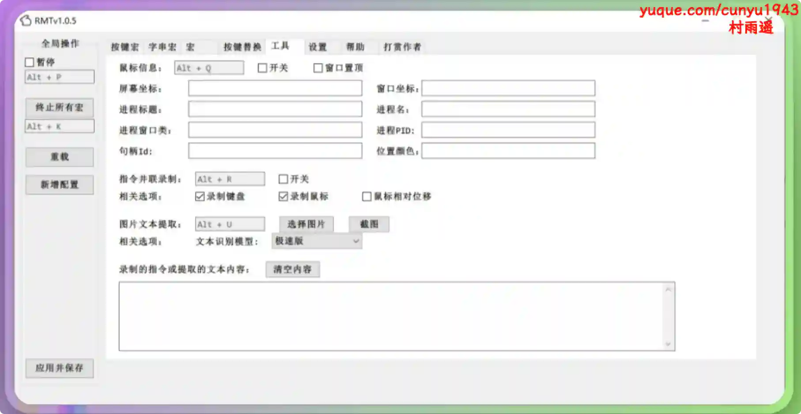
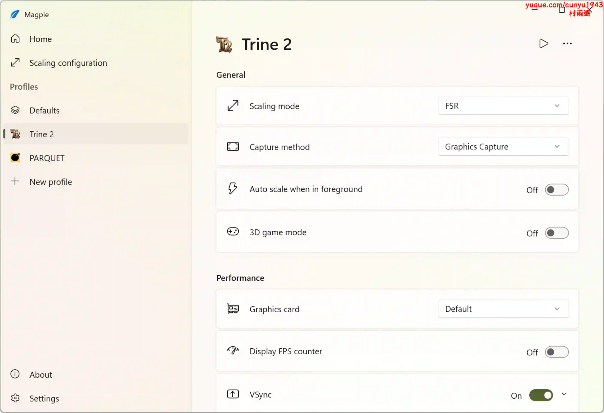
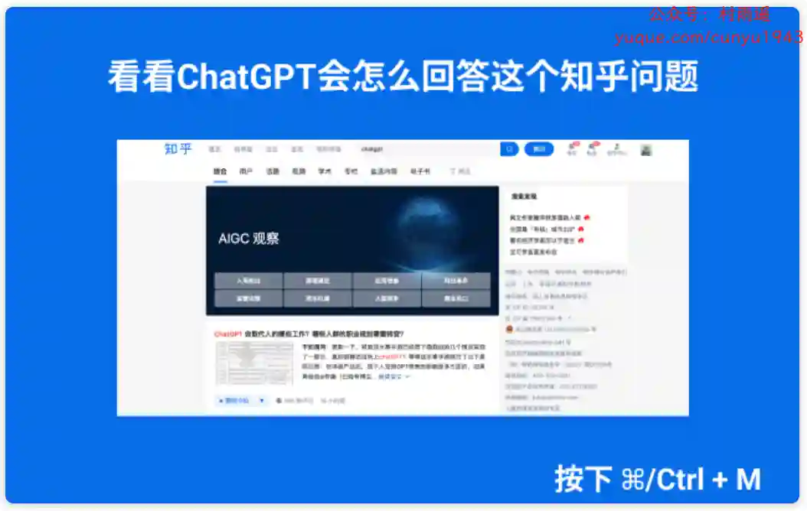

# 好物周刊#119：学生免费资源

> 作者：[村雨遥](https://github.com/cunyu1943)
> 
> 不要哀求，学会争取，若是如此，终有所获
> 
> 原文：https://mp.weixin.qq.com/s/vRNGp-25tWwUiGJUx1m7FQ

## 🎈 号外 

最近，公众号之外，建立了微信交流群，不定期会在群里分享各种资源（影视、IT 编程、考试提升……）&知识。如果有需要，可以**扫码或者后台添加小编微信备注入群**。进群后**优先看群公告**，**呼叫群中【资源分享小助手】**，还能免费帮找资源哦～

## 一、项目

### 1. [LiYing](https://github.com/aoguai/LiYing)

一套适用于自动化 完成一般照相馆后期证件照处理流程的照片自动处理的程序。

### 2. [omni-bot](https://github.com/weixin-omni/omni-bot-sdk-oss)

一个基于视觉识别，使用自定义 YOLO 模型，OCR，数据库监听，实现的运行时零侵入的 微信 4.0 RPA 框架，支持动态接入插件，适配 OpenAI，DIfy，支持解析所有消息类型，内置文本图片文件消息发送能力，可扩展小程序朋友圈发送。

### 3. [Video2PPT](https://github.com/Wangxs404/video2ppt)

一个免费的、注重隐私的在线工具，可以将任意来源的视频转换为PPT演示文稿。从本地视频文件、在线视频链接或实时录屏中提取关键信息，生成精美的PPT文档。

## 二、软件

### 1. [RMT](https://github.com/zclucas/RMT)

一款基于 AutoHotkey v2 的免费开源按键宏工具，致力于让用户通过简单配置即可实现各类自动化操作。它支持按键宏、鼠标宏的录制与播放，同时集成了图片识别、颜色识别和文本识别等功能，满足从游戏辅助到办公效率提升的多种需求。无论是重复性操作还是复杂交互流程，RMT 都能一键化处理，让你的工作和娱乐更加轻松、高效。

### 2. [Magpie](https://github.com/Blinue/Magpie)

一个轻量级的窗口缩放工具，内置了多种高效的缩放算法和滤镜。主要用于提升游戏画质和让不支持全屏化的游戏也能全屏显示等。

### 3. [MyKeymap](https://github.com/xianyukang/MyKeymap)

一款基于 AutoHotkey 的键盘映射工具，用于增强 Windows 的键盘输入体验和窗口操作效率。

## 三、网站

### 1. [Veo 3 Prompt Hub](https://www.veo3-prompt.com)

AI 视频生成提示词库，精选高质量 Veo 3 AI 视频提示词，包含 ASMR、科幻、战争、日常场景。助力创作者快速制作专业 AI 视频，免费使用。

### 2. [visalist](https://visalist.io)

面向全球旅行者的签证信息导航平台，共计收录了 239 个国家的签证类型、申请条件、所需材料、办理周期、费用等相关信息。更有签证新闻、旅行目的地、会员专用数据、优惠和折扣等内容。

### 3. [学生免费资源](https://edu.52it.de)

专属学生优惠与免费福利，包含软件工具、购物优惠、休闲娱乐、人工智能等方面内容。

## 四、插件

### 1. [Easy Scraper](https://chromewebstore.google.com/detail/easy-scraper-one-click-we/cljbfnedccphacfneigoegkiieckjndh)

只需单击一下，即可从任何网站提取数据，并简化您的数据分析、研究和内容聚合任务。

### 2. [ChatGPT for 知乎](https://chromewebstore.google.com/detail/chatgpt-for-zhihu/ajnofpkfojgkfmcniokfhodfoedkameh)

将 OpenAI ChatGPT 接入到知乎中，为你提供更加高效、只智能的问答服务。

### 3. [知乎外链直达](https://chromewebstore.google.com/detail/chidjfbdenglhicdckjnjccccpgknfhg?utm_source=item-share-cb)

移除知乎外部链接重定向，加速上网、避免访问追踪。在知乎点击外链时，会先到重定向页面（link.zhihu.com），再跳转到目标页。但是网速慢的情况下，等待跳转是很耗费时间的，而且复制的链接变成了重定向 URL。本扩展可以跳过外链重定向，直达目标网址。

## 五、资料

### 1. [开源大模型食用指南](https://github.com/datawhalechina/self-llm)

一个围绕开源大模型、针对国内初学者、基于 Linux 平台的中国宝宝专属大模型教程，针对各类开源大模型提供包括环境配置、本地部署、高效微调等技能在内的全流程指导，简化开源大模型的部署、使用和应用流程，让更多的普通学生、研究者更好地使用开源大模型，帮助开源、自由的大模型更快融入到普通学习者的生活中。

### 2. [How To Secure A Linux Server](https://github.com/imthenachoman/How-To-Secure-A-Linux-Server)

一个收录启用 Linux 服务器的安全措施指南，它也能教你一些关于安全性及其重要性的知识点。

### 3. [LangShift.dev](https://github.com/erweixin/langshift.dev)

一个专门为开发者设计的编程语言转换学习平台。通过对比不同编程语言的语法特性和概念映射，帮助你快速理解新语言的核心概念，并能够将其应用到实际项目中。

## ✍️ 说明

周刊专栏相关信息：

- **项目地址**：[Github](https://github.com/cunyu1943/weekly)，觉得不错麻烦给我一个**Star**，感谢 ❤️
- **浏览地址**：公众号 | [电子书](https://cunyu1943.github.io/weekly) | [语雀](https://yuque.com/cunyu1943/weekly)

如果你阅读到这里，说明我的工作没有白费。如果你想推荐项目/网站/软件/资源，欢迎提交 **[issue](https://github.com/cunyu1943/weekly/issues)** 或者添加我 **个人微信：coder_cunYu** 与我交流。

---

## ⏳ 联系

想解锁更多知识？不妨关注我的微信公众号：**村雨遥（id：JavaPark）**。

扫一扫，探索另一个全新的世界。

