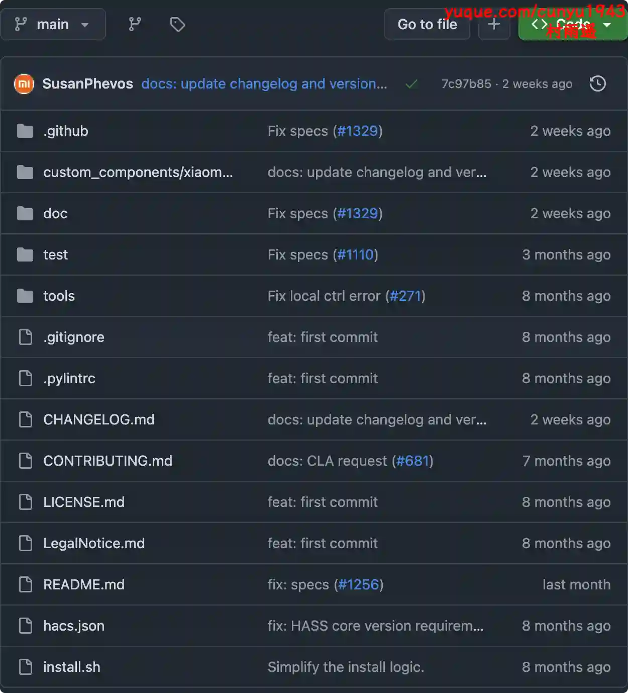
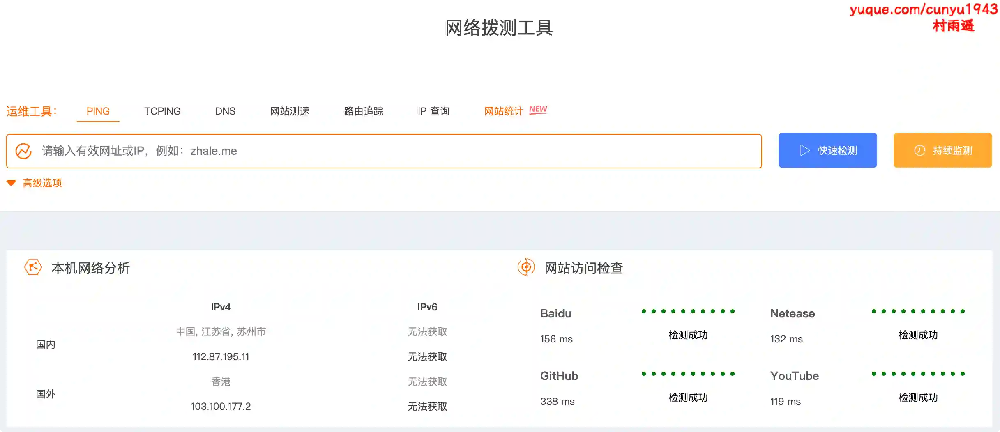
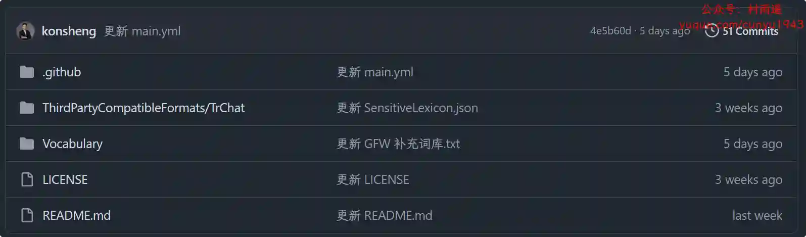
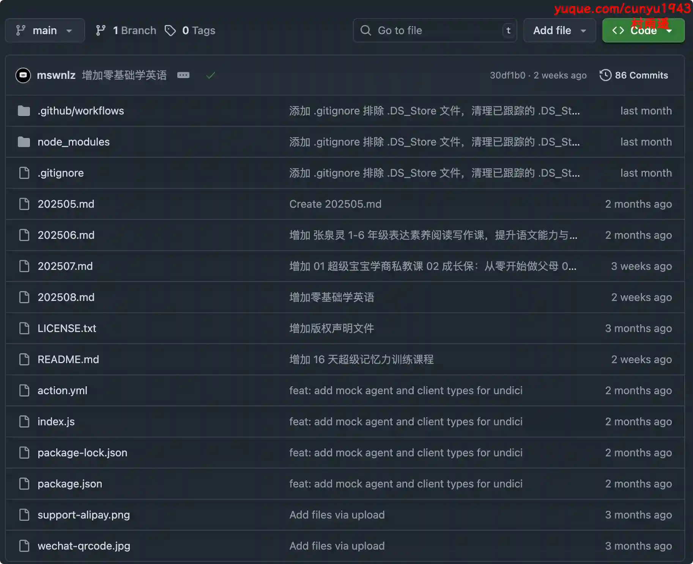

# 好物周刊#120：OfficeMind

> 作者：[村雨遥](https://github.com/cunyu1943)
> 
> 不要哀求，学会争取，若是如此，终有所获
> 
> 原文：https://mp.weixin.qq.com/s/t_FjSBB9n_Gz7F3pQuw2ag

## 🎈 号外 

最近，公众号之外，建立了微信交流群，不定期会在群里分享各种资源（影视、IT 编程、考试提升……）&知识。如果有需要，可以**扫码或者后台添加小编微信备注入群**。进群后**优先看群公告**，**呼叫群中【资源分享小助手】**，还能免费帮找资源哦～

## 一、项目

### 1. [easyVoice](https://github.com/cosin2077/easyVoice)

一个开源的文本、小说智能转语音解决方案，旨在帮助用户轻松将文本内容转换为高质量的语音输出。

-   一键生成语音和字幕
-   AI 智能推荐配音
-   完全免费，无时长、无字数限制
-   支持将 10 万字以上的小说一键转为有声书！

-   流式传输，多长的文本都能立刻播放
-   支持自定义多角色配音

### 2. [Xget](https://github.com/xixu-me/Xget)

超高性能、安全的一站式开源资源获取加速引擎。其性能远超传统加速器，为您提供跨多个平台的统一高效的加速体验，涵盖代码储存库、包管理、AI 推理 API、容器镜像、模型及数据集等。

### 3. [Home Assistant 米家集成](https://github.com/XiaoMi/ha_xiaomi_home)

一个由小米官方提供支持的 Home Assistant 的集成组件，它可以让您在 Home Assistant 中使用小米 IoT 智能设备。

## 二、软件

### 1. [So Novel](https://github.com/freeok/so-novel)

一款通用的网页内容处理与导出工具，它致力于帮助用户高效地从网页中提取结构化信息，并将其灵活导出为 EPUB、TXT、PDF 等多种标准电子文档格式。适用于学习采集、格式转换、电子书制作等场景。

### 2. [flybird-downloader](https://github.com/youwen21/flybird-downloader)

一个视频下载工具，可下载 m3u8 视频 、 mpd 视频 、 mp4 视频和大文件断点续传。

### 3. [OfficeMind](https://officemind.cn)

一款免费的智能AI办公工具软件，专为 Microsoft Office 和 WPS 用户打造。 无论你是在寻找如何输入“打勾（√）符号”的方法，还是想知道“怎么在插入表格前添加文字”，或者“该用哪个公式”， AI办公助手都能为你提供快速、准确的解决方案。通过简单的指令，ExcelAI 插件可以帮你自动完成复杂的公式计算、函数选择。 WordAI 插件还具备整理周报、撰写会议纪要、总结内容、以及文案润色的强大功能。 总之，OfficeMind 助手将大大提升你的办公效率，让日常工作变得更加轻松便捷。

## 三、网站

### 1. [Library of Short Stories](https://www.libraryofshortstories.com)

免费短片小说库，专为文学爱好者打造，收录了许多经典文学作品，涵盖传奇故事、文艺作品、奇幻冒险、讽刺小说等类别内容。

### 2. [炸了么](https://zhale.me)

提供全球 1000 + 网络拨测节点，模拟用户访问域名/IP，运维必备实用小工具。

### 3. [猫啃网](https://www.maoken.com)

最新最全的无版权可免费商用中文字体下载网站，致力于与大家分享无版权问题的免费商用字体信息。

## 四、插件

### 1. [便捷搜索](https://chromewebstore.google.com/detail/oldegmeclddhhdpeaedkbfphghkmhnid?utm_source=item-share-cb)

支持在 Google、百度、必应等搜索引擎间进行快捷切换，搜索关键词无需重输，支持右键搜索。

### 2. [打开隐身选项卡](https://chromewebstore.google.com/detail/ebgmlfdcgihhfheckfdmhnmedjigogmm?utm_source=item-share-cb)

点击一下即可将当前选项卡切换到私人浏览模式，进入隐身模式并从浏览历史中删除标签页 URL。

### 3. [BiliScope](https://chromewebstore.google.com/detail/ekmbchepcdggpcbdpjpijphjiiiimfga?utm_source=item-share-cb)

可以显示视频的 AI 内容总结，在 B 站的各类网页上显示用户的详细信息，包括关注数、粉丝数、投稿数、签名、投稿词云等等，还可以给 UP 主做备注和标签！

## 五、资料

### 1. [业余无线电执照考试模拟（2025 题库）](https://github.com/AlliotTech/ham-exam-web)

基于官方最新题库构建的在线模拟与练习应用，支持 A / B / C 三类考试，提供真实规则抽题、计时交卷、练习搜索、答题卡与标记、PWA 安装等功能。

### 2. [中文敏感词库](https://github.com/konsheng/Sensitive-lexicon)

一个持续更新的中文敏感词库，帮助开发者和内容审核者快速识别并过滤不当文本。

### 3. [edu-knowlege](https://github.com/mswnlz/edu-knowlege)

教育各种资料，从幼儿园到小学、中学，涵盖学而思，万维、猿辅导等多个机构，持续增加中。

## ✍️ 说明

## ✍️ 说明

周刊专栏相关信息：

- **项目地址**：[Github](https://github.com/cunyu1943/weekly)，觉得不错麻烦给我一个**Star**，感谢 ❤️
- **浏览地址**：公众号 | [电子书](https://cunyu1943.github.io/weekly) | [语雀](https://yuque.com/cunyu1943/weekly)

如果你阅读到这里，说明我的工作没有白费。如果你想推荐项目/网站/软件/资源，欢迎提交 **[issue](https://github.com/cunyu1943/weekly/issues)** 或者添加我 **个人微信：coder_cunYu** 与我交流。

---

## ⏳ 联系

想解锁更多知识？不妨关注我的微信公众号：**村雨遥（id：JavaPark）**。

扫一扫，探索另一个全新的世界。

