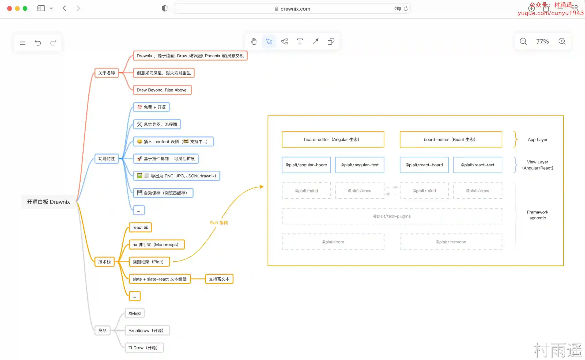
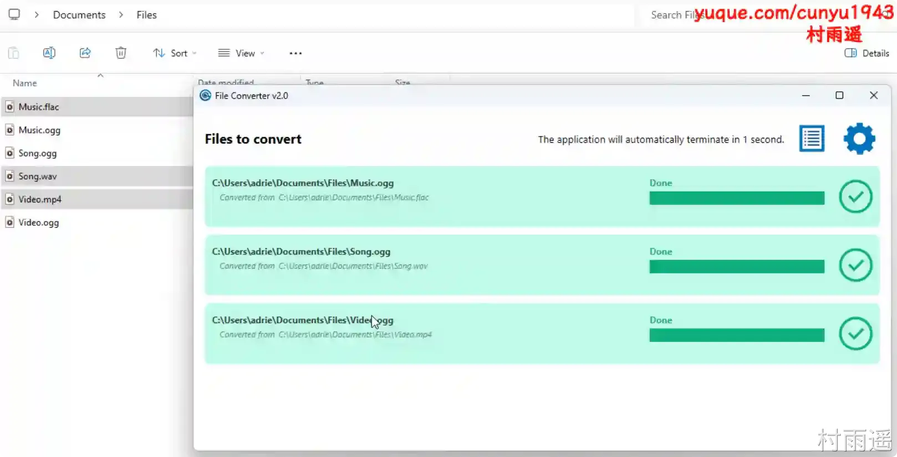
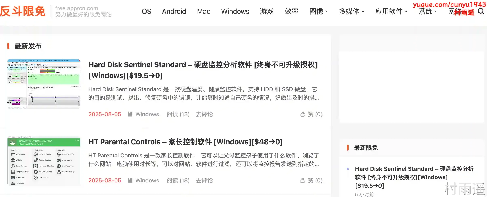
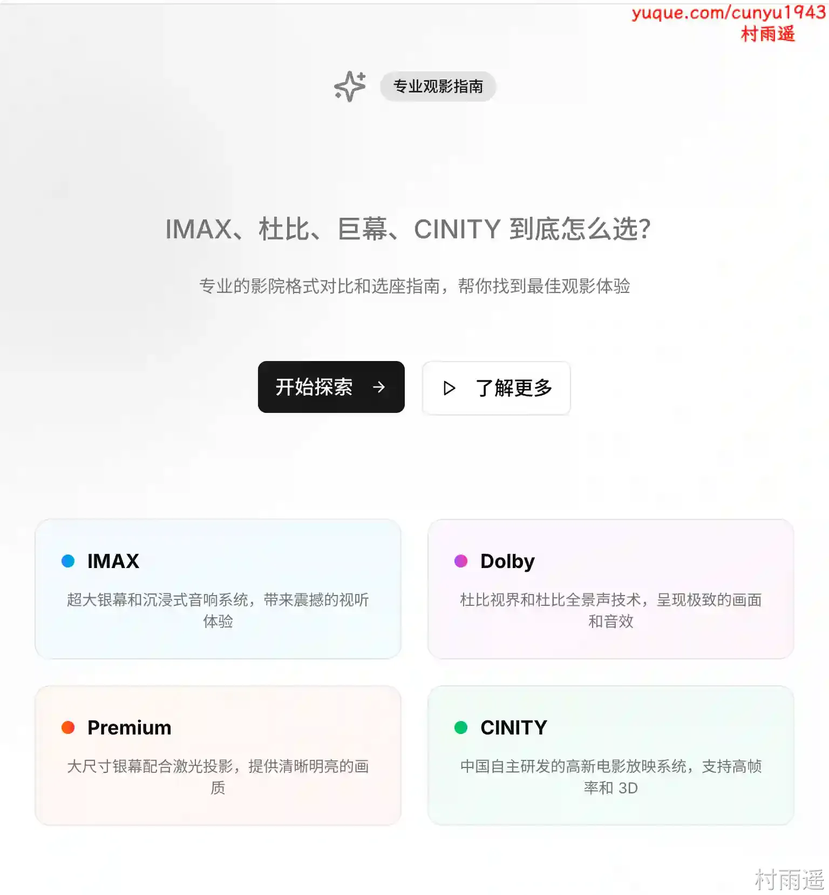
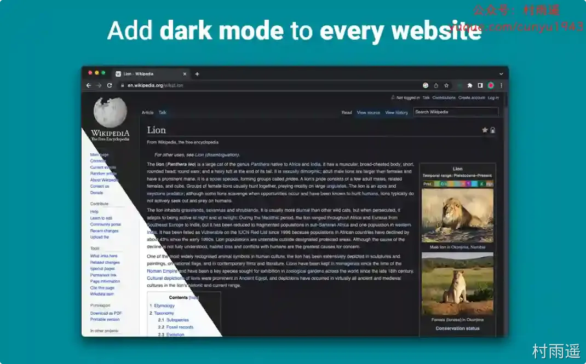
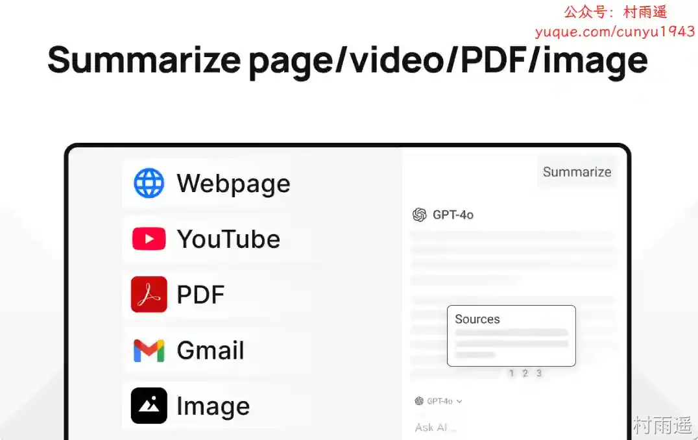

# 好物周刊#121：影院选择专家

> 作者：[村雨遥](https://github.com/cunyu1943)
> 
> 不要哀求，学会争取，若是如此，终有所获
> 
> 原文：https://mp.weixin.qq.com/s/SIjd2Ky8wB7-nwPU9ja-Lw

## 🎈 号外 

最近，公众号之外，建立了微信交流群，不定期会在群里分享各种资源（影视、IT 编程、考试提升……）&知识。如果有需要，可以**扫码或者后台添加小编微信备注入群**。进群后**优先看群公告**，**呼叫群中【资源分享小助手】**，还能免费帮找资源哦～

## 一、项目

### 1. [Drawnix](https://github.com/plait-board/drawnix)

开源白板工具（SaaS），一体化白板，包含思维导图、流程图、自由画等。

### 2. [Claude Code PM](https://github.com/automazeio/ccpm)

针对 Claude Code 的项目管理系统，使用 GitHub issue 和 Git 工作树进行并代理执行。

### 3. [HotGo](https://github.com/bufanyun/hotgo)

一个基于 vue 和 goframe2.0 开发的全栈前后端分离的开发基础平台和移动应用平台，集成 jwt 鉴权，动态路由，动态菜单，casbin 鉴权，消息队列，定时任务等功能，提供多种常用场景文件，让您把更多时间专注在业务开发上。

## 二、软件

### 1. [HackBrowserData](https://github.com/moonD4rk/HackBrowserData)

用于从浏览器解密和导出浏览器数据（密码、历史记录、cookie、书签、信用卡、下载历史记录、localStorage 和扩展程序）的命令行工具。支持当前主流浏览器，可在Windows、macOS 和 Linux 上运行。

### 2. [File Converter](https://file-converter.io)

一款开源免费的文件格式转换器，支持音视频、图像、文档等格式批量转换。

### 3. [极速图片压缩器](https://www.zgcoder.com/tic)

稳定好用且压缩速度极快的桌面端图片压缩软件，支持 7 种格式，单张最大 2 GB，最大支持 20000 张。

## 三、网站

### 1. [Bracelet Book](https://www.braceletbook.com)

一个专为友谊手环和手工编绳爱好者打造的学习分享平台。提供了多种图案设计、详细教程以及社区作品展示。从入门基础到进阶技巧，全部免费开放。

### 2. [反斗限免](https://free.apprcn.com)

汇总各类限免信息的网站，包括 iOS 限免、Stream 限免、软件限免等。

### 3. [影院选择专家](https://cinema-expert.toolsnav.top)

专业影院格式对比和选座指南，无需在纠结到底选哪个，直接告知你不同影院放映格式最佳观影位置，避免踩坑。

## 四、插件

### 1. [SponsorBlock for YouTube](https://chromewebstore.google.com/detail/mnjggcdmjocbbbhaepdhchncahnbgone?utm_source=item-share-cb)

跳过 YouTube 视频中的赞助广告、订阅提醒等片段，标记视频中的赞助广告来节约大家的时间。

### 2. [黑暗模式-夜眼](https://chromewebstore.google.com/detail/dark-mode-night-eye/alncdjedloppbablonallfbkeiknmkdi)

根据需要将每个网站切换到暗模式/亮模式，允许您在几乎所有网站上启用黑暗模式，从而提高可读性并减少弱光环境中的眼睛疲劳。 它还提供自定义选项，例如亮度、对比度和饱和度调整，以及用于保护眼睛的蓝光滤镜。

### 3. [MaxAI](https://chromewebstore.google.com/detail/mhnlakgilnojmhinhkckjpncpbhabphi?utm_source=item-share-cb)

为您的浏览器带来一套功能强大的 AI 工具，以简洁、极致的界面设计，助您高效完成各类在线任务。

## 五、资料

### 1. [机器学习系统：设计和实现](https://github.com/openmlsys/openmlsys-zh)

项目试图给读者讲解现代机器学习系统的设计原理和实现经验，适合学生、科研人员、开发人员使用。

### 2. [The Algorithms - Java](https://github.com/TheAlgorithms/Java)

基于 Java 实现的各种算法，仅做教学用途，因此其实现可能比某些 Java 标准库性能要弱上几分。

### 3. [引导词仓库](https://github.com/kingkongshot/prompts)

一个精心组织的引导词集合，帮助提升 AI 协作效率和质量。

## ✍️ 说明

周刊专栏相关信息：

- **项目地址**：[Github](https://github.com/cunyu1943/weekly)，觉得不错麻烦给我一个**Star**，感谢 ❤️
- **浏览地址**：公众号 | [电子书](https://cunyu1943.github.io/weekly) | [语雀](https://yuque.com/cunyu1943/weekly)

如果你阅读到这里，说明我的工作没有白费。如果你想推荐项目/网站/软件/资源，欢迎提交 **[issue](https://github.com/cunyu1943/weekly/issues)** 或者添加我 **个人微信：coder_cunYu** 与我交流。

---

## ⏳ 联系

想解锁更多知识？不妨关注我的微信公众号：**村雨遥（id：JavaPark）**。

扫一扫，探索另一个全新的世界。

