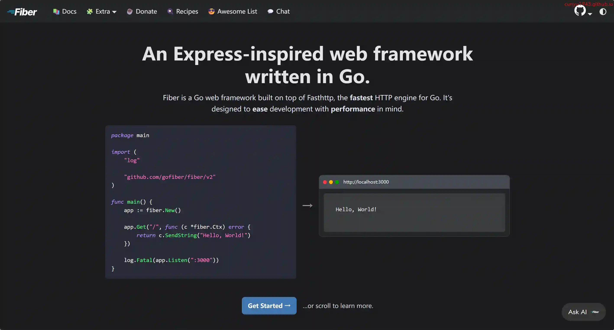
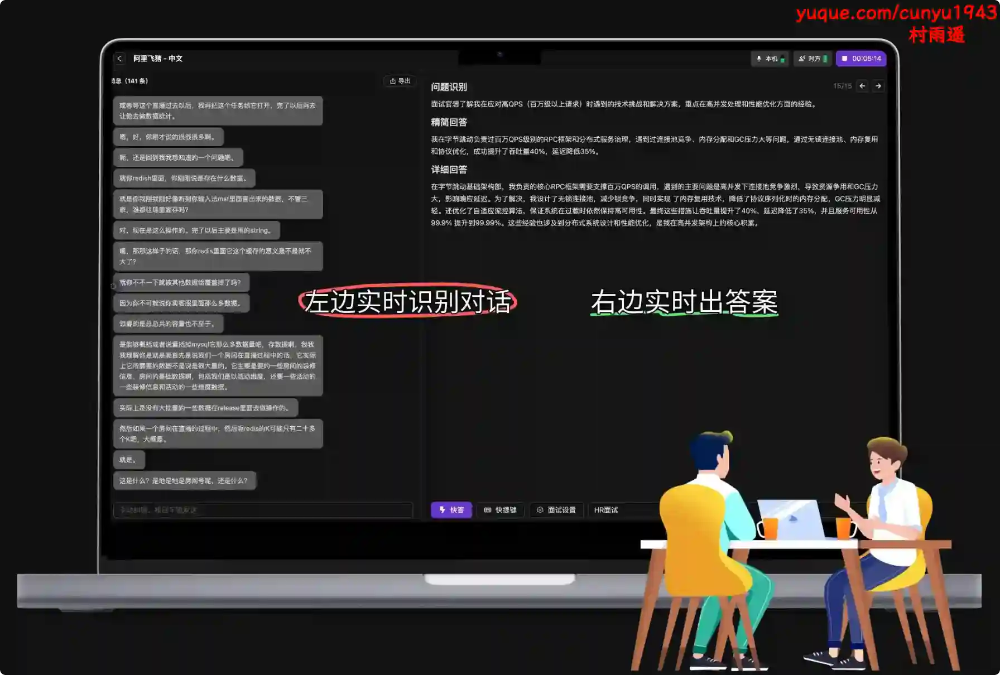
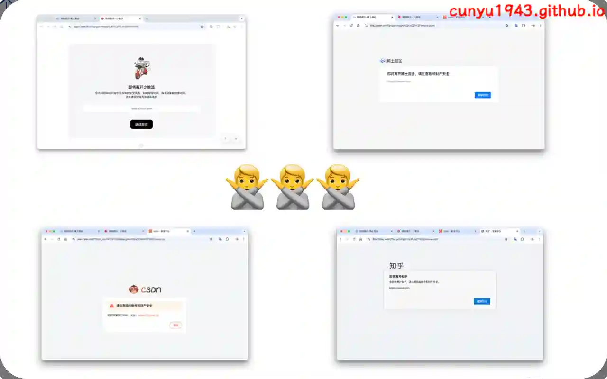
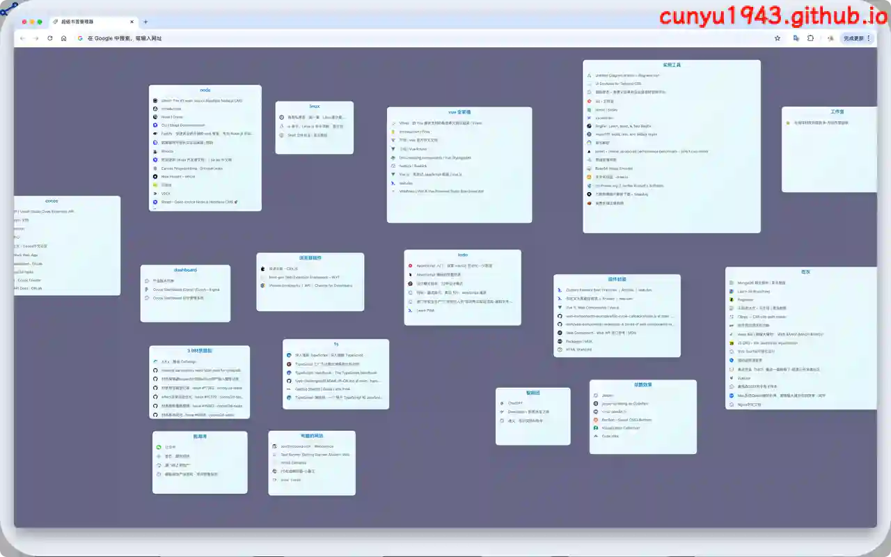
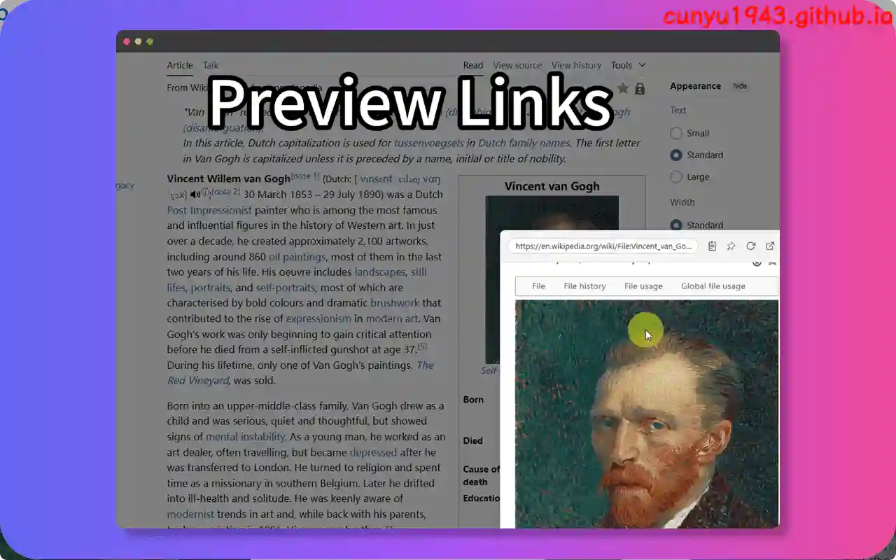
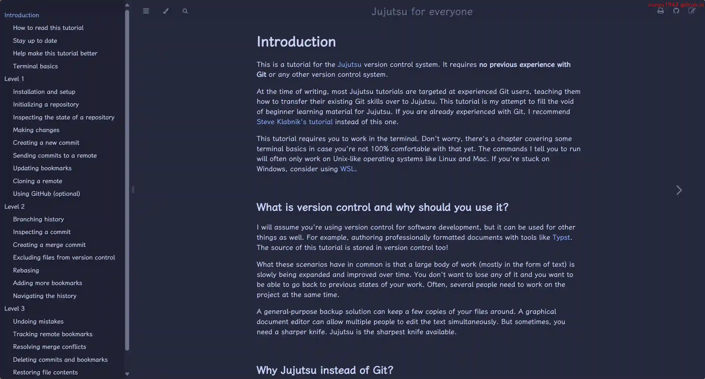
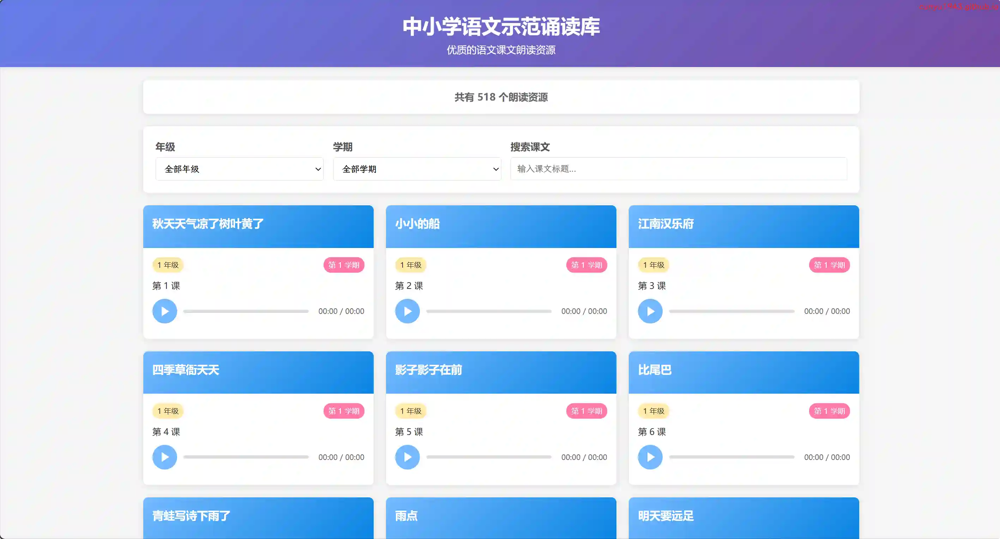

# 好物周刊#123：劳动计算器

> 作者：[村雨遥](https://github.com/cunyu1943)
> 
> 不要哀求，学会争取，若是如此，终有所获
> 
> 原文：https://mp.weixin.qq.com/s/ArcwxSWtzNcA091rIZvnoQ

## 🎈 号外 

最近，公众号之外，建立了微信交流群，不定期会在群里分享各种资源（影视、IT 编程、考试提升……）&知识。如果有需要，可以**扫码或者后台添加小编微信备注入群**。进群后**优先看群公告**，**呼叫群中【资源分享小助手】**，还能免费帮找资源哦～

## 一、项目

### 1. [Open-XiaoAI](https://github.com/idootop/open-xiaoai)

让小爱音箱听见你的声音，解锁无限可能。

### 2. [sese-engine](https://github.com/RimoChan/sese-engine)

一个轻量级的搜索引擎，可以快速部署在个人电脑上。通过爬取互联网上的数据，在本地建立各个网页的索引。这样一来，你就有了自己的搜索引擎，可以在本地直接搜索互联网上的信息。你也可以修改你的爬取和搜索配置，让搜索的结果能满足个性化的需求。

### 3. [Fiber](https://github.com/gofiber/fiber)

是一个受 Express 启发的 Web 框架，建立在用于 Go 的最快 HTTP 引擎 Fasthttp 之上。旨在简化快速开发，同时考虑零内存分配和性能。

## 二、软件

### 1. [OfferStar AI](https://www.offerstar.cn)

AI 时代面试笔试助手，秒杀八股文、手撕算法题、测评题，这些通通搞定！面试笔试都能用，真的很无敌。

### 2. [BookYell](https://bookyell.com)

探索经典英文文学的世界，提高您的英语输入量！我们提供各类英文经典原著作品，包括简·奥斯汀的《傲慢与偏见》等。立即阅读，让英语学习变得更简单有趣！

### 3. [Bilidown](https://github.com/iuroc/bilidown)

哔哩哔哩视频解析下载工具，支持 8K 视频、Hi-Res 音频、杜比视界下载、批量解析，可扫码登录，常驻托盘。

## 三、网站

### 1. [劳动计算器](https://web.laofa.com/calculator/)

全国劳动法数据快速精确计算应用。根据用户输入的条件计算法定经济补偿金、法定年休假、工伤待遇等项目，并给出计算依据提示。已收录城市计算口径已经经过数万次计算验证。

### 2. [GreenVideo](https://greenvideo.cc)

免费无水印下载哔哩哔哩、抖音、YouTube 等平台视频。

### 3. [Crop Image](https://cropimage.com/)

免费在线裁剪图像。无需注册。支持 JPEG、PNG 和其他格式。图像在您的设备上处理。

## 四、插件

### 1. [redirect-skipper](https://chromewebstore.google.com/detail/redirect-skipper/bcjldhihfjnhgmkmdeojigknladnbcek?authuser=0&hl=zh-CN)

一款让你无感跳过各种提示外链中转页的浏览器插件，无感跳过 掘金、 知乎、 少数派、 CSDN 等站点的外链提示页，让你的网页浏览体验更加顺畅。

### 2. [Better-Bookmarks](https://chromewebstore.google.com/detail/better-bookmarks/ieahkhpkiipfkiecndclbbfjfhceiknh?utm_source=item-share-cb)

一个以无限画布平铺展示的书签管理器，用于替换浏览器的「书签管理」页面。

### 3. [NoTab](https://chromewebstore.google.com/detail/anfjigoimfhbhkcpggoomegmafgmnada?utm_source=item-share-cb)

在当前页面预览链接，支持翻译、搜索、阅读模式，极大提升你的浏览体验。非常适合沉浸式浏览社交媒体和新闻源、观看视频以及阅读文章，不会让浏览器因多个选项卡而变得杂乱。

## 五、资料

### 1. [90-Day Cybersecurity Study Plan](https://github.com/farhanashrafdev/90DaysOfCyberSecurity)

90 天快学入门网络安全，一份结构清晰，从基础概念到核心进阶技能，涵盖渗透测试、漏洞分析、防御策略等内容。

### 2. [Jujutsu 入门教程](https://github.com/jj-for-everyone/jj-for-everyone.github.io)

一个新兴的代码管理系统，号称比 Git 更简单好用。这是一份关于它的教程，帮助未使用过 Git 的人入门。

### 3. [中小学语文示范诵读库](https://github.com/ZedeX/mandarin-reading-resource)

一个基于 Web 的音频播放平台，专门用于展示中小学语文课文的朗读音频资源。它提供了按年级、学期分类的音频资源浏览功能，以及搜索和分页功能，让用户能够方便地找到并播放所需的课文朗读音频。

## ✍️ 说明

周刊专栏相关信息：

- **项目地址**：[Github](https://github.com/cunyu1943/weekly)，觉得不错麻烦给我一个**Star**，感谢 ❤️
- **浏览地址**：公众号 | [电子书](https://cunyu1943.github.io/weekly) | [语雀](https://yuque.com/cunyu1943/weekly)

如果你阅读到这里，说明我的工作没有白费。如果你想推荐项目/网站/软件/资源，欢迎提交 **[issue](https://github.com/cunyu1943/weekly/issues)** 或者添加我 **个人微信：coder_cunYu** 与我交流。

---

## ⏳ 联系

想解锁更多知识？不妨关注我的微信公众号：**村雨遥（id：JavaPark）**。

扫一扫，探索另一个全新的世界。

