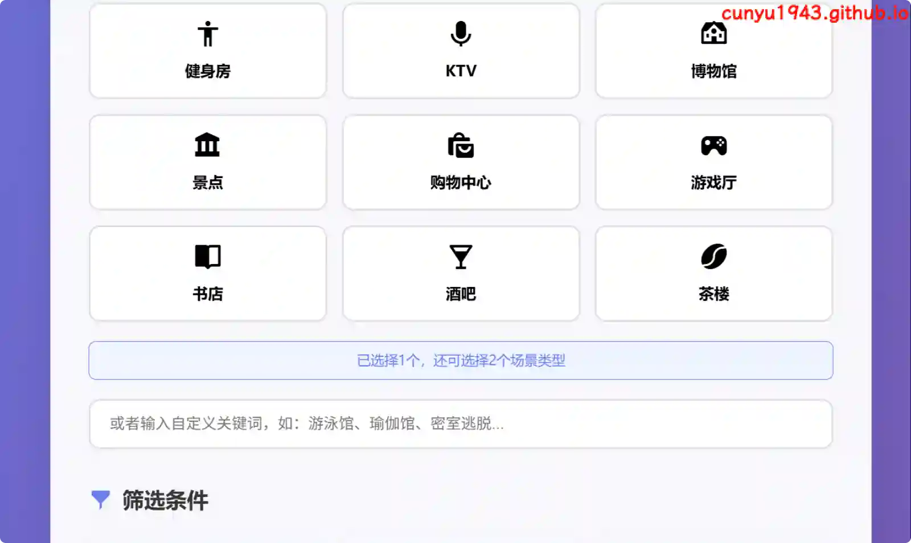
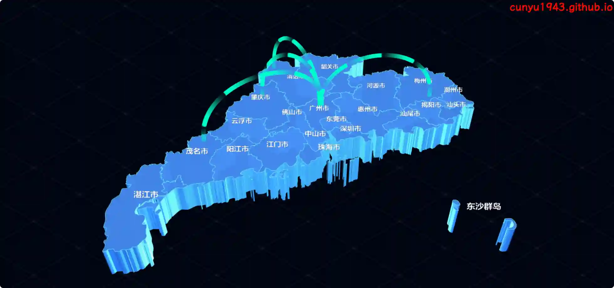
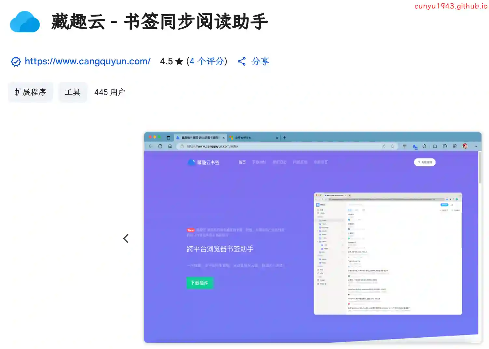
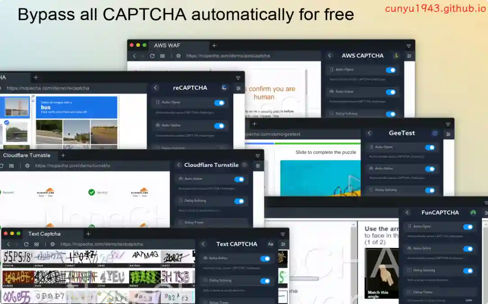
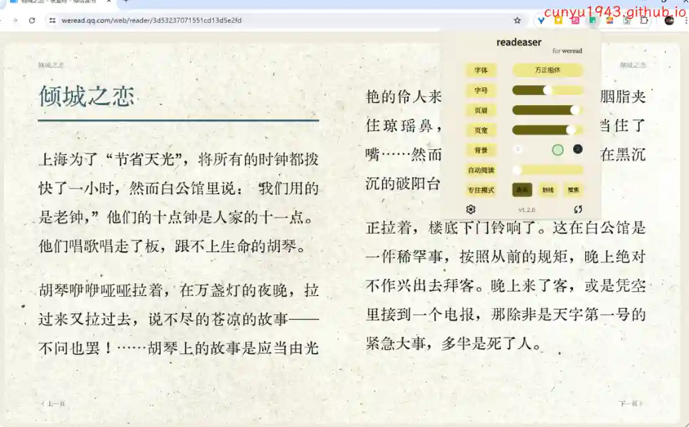
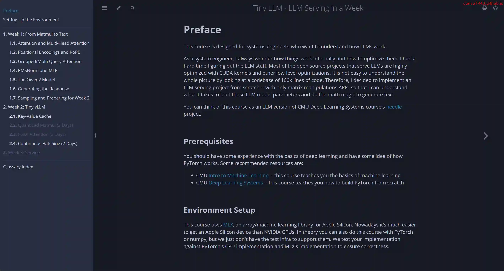
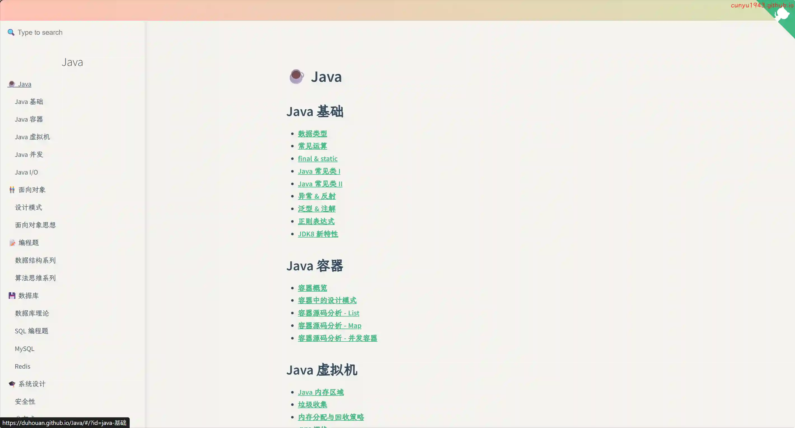

# 好物周刊#124：美团小美

> 作者：[村雨遥](https://github.com/cunyu1943)
> 
> 不要哀求，学会争取，若是如此，终有所获
> 
> 原文：https://mp.weixin.qq.com/s/zUeo_0ZZvKyCric_5E8xLA

## 🎈 号外 

最近，公众号之外，建立了微信交流群，不定期会在群里分享各种资源（影视、IT 编程、考试提升……）&知识。如果有需要，可以**扫码或者后台添加小编微信备注入群**。进群后**优先看群公告**，**呼叫群中【资源分享小助手】**，还能免费帮找资源哦～

## 一、项目

### 1. [OuonnkiTV](https://github.com/Ouonnki/OuonnkiTV)

一键搭建个人影视站，支持 Vercel 自动部署，基于 LibreTV 修改。

### 2. [网盘分享链接云解析服务](https://github.com/qaiu/netdisk-fast-download)

网盘直链云解析 (nfd 云解析) 能把网盘分享下载链接转化为直链，支持多款云盘，已支持蓝奏云/蓝奏云优享/奶牛快传/移动云云空间/小飞机盘/亿方云/123 云盘/Cloudreve 等，支持加密分享，以及部分网盘文件夹分享。

### 3. [MeetSpot](https://github.com/JasonRobertDestiny/MeetSpot)

一个智能的会面地点推荐 agent，旨在帮助用户根据多个参与者的位置和特定需求，快速找到最合适的会面场所。无论是寻找安静的咖啡馆进行商务会谈，还是热闹的餐厅朋友聚餐，或是适合学习的图书馆，聚点都能为您提供智能化的推荐。

## 二、软件

### 1. [Ham Hub](https://www.hamhub.app)

一款全能的网盘播放器和私人云影专家，完美支持阿里云盘、百度网盘、夸克网盘等多种云盘播放，兼容Emby、Jellyfin、Plex等主流媒体服务器。提供智能剧集整理、个性化收藏、云端同步、离线缓存等功能，支持iOS、Android、macOS、AppleTV等全平台。

### 2. [小美](https://a.vmall.com/app/C114391189)

美团发布的收款 AI Agent 应用，一个小而美的 AI 生活小秘书，能帮你想、代你办。

### 3. [V2er-Android](https://github.com/v2er-app/Android)

V2EX 第三方客户端，界面简洁颜值高，体验丝滑，适合只想安静刷社区内容的用户。

## 三、网站

### 1. [文字转手写](https://text-to-handwriting.org)

一个免费在线工具，在各种纸张背景上将数字文字转换为漂亮的手写笔记。

### 2. [章快图](https://zhang.kuaitu.cc/)

免费在线 PDF 盖章工具，支持添加普通印章和骑缝章，快速处理 PDF 文档盖章需求，无需下载软件。

### 3. [NB Map](https://www.nbcharts.com/map/map.php)

一款三维地图的工具，可以随意调节地图颜色、板块高度、旋转不同的角度… 调整成你需要的地图后，可以下载透明背景的 PNG 格式。也可以点击动画按钮后录制成视频。

## 四、插件

### 1. [藏趣云](https://chromewebstore.google.com/detail/ddpgbedkkfhopdodlekfjglofodoegog?utm_source=item-share-cb)

藏趣云浏览器书签，是保存所有您喜爱的书籍、歌曲、文章、稍后阅读或您在浏览时遇到的任何其他内容的最佳场所，并且支持阅读模式，网页持久化快照，自动备份至百度云盘等功能，数据无后顾之忧！

### 2. [NopeCHA: CAPTCHA Solver](https://chromewebstore.google.com/detail/nopecha-captcha-solver/dknlfmjaanfblgfdfebhijalfmhmjjjo?hl=zh-CN)

一款能够自动识别图片验证码的浏览器扩展，可以自动识别验证码，无需再手动点击，从此解放双手。

### 3. [readeaser](https://chromewebstore.google.com/detail/readeaser/pfibgbgioglhioghjjikmndejenllpnh)

美化微信读书网页版，支持双栏模式、PDF 阅读。参考微信读书移动端主题，四种颜色主题可切换，而且支持自动阅读。

## 五、资料

### 1. [中国高校学科评估排名系统](https://wiibil.dpdns.org)

提供最新第四轮学科评估数据，覆盖哲学、经济学、法学等门类。按学科查询高校排名，找到 A+、A、B+ 等评级的高校和专业。

### 2. [Tiny LLM - LLM Serving in a Week](https://github.com/skyzh/tiny-llm)

为系统工程师提供的基于 Apple Silicon 的 LLM 推理学习课程，一周之内教你构建一个微型 vLLM + Qwen。

### 3. [Java 知识](https://github.com/DuHouAn/Java)

本仓库是对 Java 的一些基础知识、数据库知识、以及框架知识进行收集、整理。

## ✍️ 说明

周刊专栏相关信息：

- **项目地址**：[Github](https://github.com/cunyu1943/weekly)，觉得不错麻烦给我一个**Star**，感谢 ❤️
- **浏览地址**：公众号 | [电子书](https://cunyu1943.github.io/weekly) | [语雀](https://yuque.com/cunyu1943/weekly)

如果你阅读到这里，说明我的工作没有白费。如果你想推荐项目/网站/软件/资源，欢迎提交 **[issue](https://github.com/cunyu1943/weekly/issues)** 或者添加我 **个人微信：coder_cunYu** 与我交流。

---

## ⏳ 联系

想解锁更多知识？不妨关注我的微信公众号：**村雨遥（id：JavaPark）**。

扫一扫，探索另一个全新的世界。

