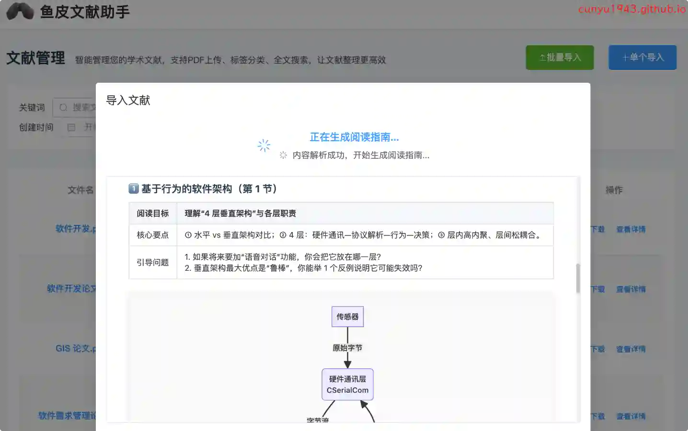
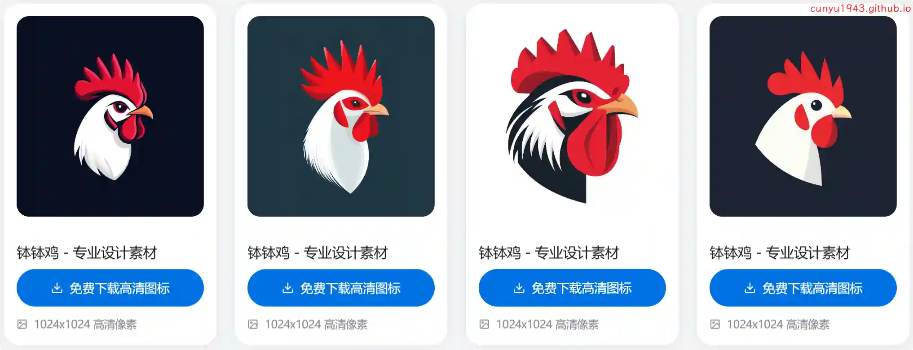
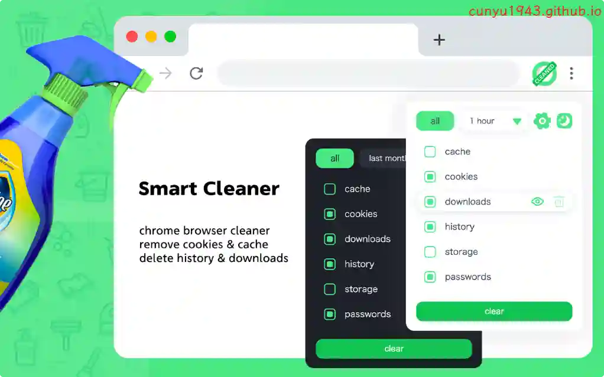
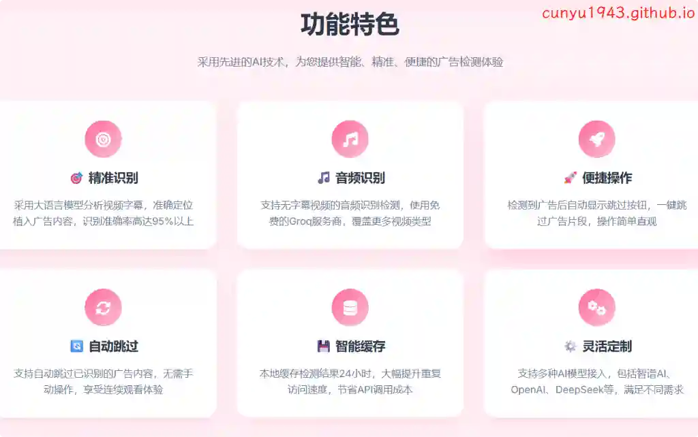
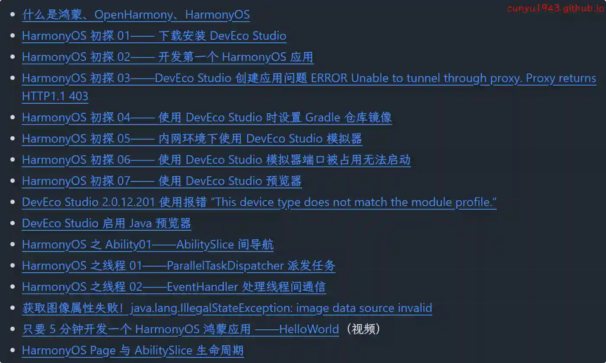
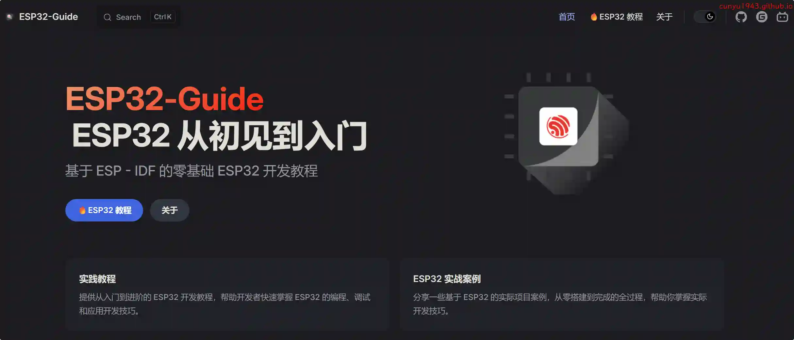
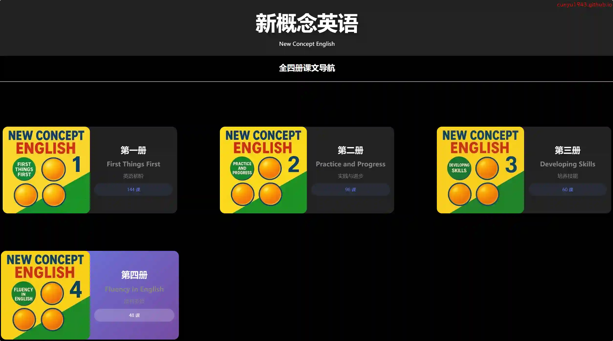

# 好物周刊#125：钵钵鸡

> 作者：[村雨遥](https://github.com/cunyu1943)
> 
> 不要哀求，学会争取，若是如此，终有所获
> 
> 原文：https://mp.weixin.qq.com/s/2Q2DN04aw5-nGk-8mc4mDA

## 🎈 号外 

最近，公众号之外，建立了微信交流群，不定期会在群里分享各种资源（影视、IT 编程、考试提升……）&知识。如果有需要，可以**扫码或者后台添加小编微信备注入群**。进群后**优先看群公告**，**呼叫群中【资源分享小助手】**，还能免费帮找资源哦～

## 一、项目

### 1. [鱼皮文献助手](https://github.com/liyupi/literature-assistant)

一个基于 Spring Boot 3 + Vue 的现代化文献管理后端服务，集成 AI 技术为用户提供智能文献阅读指南生成、文献管理和检索功能。

### 2. [蛐蛐](https://github.com/yan5xu/ququ)

 Wispr Flow 的开源免费替代方案，专为中文用户打造的注重隐私的桌面端语音输入与文本处理工具。与 Wispr Flow 不同，蛐蛐完全开源免费，数据本地处理，专为中文优化，支持国产 AI 模型。

### 3. [PandoraHelper](https://github.com/nianhua99/PandoraHelper)

使用 PandoraHelper 轻松和你的小伙伴共享 ChatGPT Plus / Claude Pro 服务！

## 二、软件

### 1. [Seelen UI](https://github.com/eythaann/Seelen-UI)

专为 Windows 10/11 而设计的桌面环境，旨在增强您的 Windows 桌面体验，重点是定制和生产力。它可以顺利地集成到您的系统中，提供一系列功能，使您可以个性化桌面并优化工作流程。

### 2. [LazyTyper](https://lazytyper.com)

告别手动输入的繁琐！这是一款基于 Whisper 的免费语音输入应用，准确率高达 90%，速度超快且体积小巧。它完美支持中英日韩等多语言无缝混合输入，让沟通更高效。立即体验未来输入方式！

### 3. [AiNiee](https://github.com/NEKOparapa/AiNiee)

一款专注于 Ai 翻译的工具，一键自动翻译 RPG SLG 游戏，Epub TXT 小说，Srt Vtt Lrc 字幕，Word MD 文档等等复杂长文本。

## 三、网站

### 1. [PICaboo](https://pic-aboo.com)

来自日本的插图素材网站，提供各种免费可爱的向量插图，涵盖季节、学校、人物、运动、医疗、动物、食物、交通、建筑物等共 15 种类别。

### 2. [钵钵鸡](https://bobo-ji.com)

提供高品质钵钵鸡图标素材，包含餐饮、美食、川菜等多种商用图标。支持 1024x1024 高清像素下载，满足品牌设计和店铺装修需求。

### 3. [Icons8](https://igoutu.cn)

Icons8 团队、设计软件和人工智能工具精心绘制的原创图片库。提供免费的图标、剪贴画插图、照片和音乐，为创作人员和开发人员准备的终极设计套件。

## 四、插件

### 1. [PaperPanda 2](https://chromewebstore.google.com/detail/paperpanda-2/bemebjmedbchekdgnnieldmdhdnfnfnn)

一款面向学术场景的浏览器扩展，支持一键查找并获取对应论文 PDF，十分适合学生、研究人员和高校学者使用，无需再为昂贵的研究论文买单。

### 2. [Cleaner](https://chromewebstore.google.com/detail/cleaner-history-cache-cle/pooaemmkohlphkekccfajnbcokjlbehk)

一个有用的浏览器扩展，可以帮助您快速清理浏览器。有助于删除您的在线活动的所有痕迹，以保护您的隐私。

### 3. [VideoAdGuard](https://chromewebstore.google.com/detail/videoadguard/nmkkpflniidbbodhjhjaijadbccidbgi?hl=zh-CN)

基于大语言模型，自动识别 B 站视频中的植入/口播广告，当视频进入与内容不相关口播广告时，可自动跳过广告。

## 五、资料

### 1. [跟老卫学 HarmonyOS 开发](https://github.com/waylau/harmonyos-tutorial)

一本 HarmonyOS 应用开发的开源学习教程，主要介绍如何从 0 开始开发 HarmonyOS 应用。本书包括最新版本 HarmonyOS（HarmonyOS 6）中的新特性。图文并茂，并通过大量实例带你走进 HarmonyOS 的世界！

### 2. [ESP32 从初见到入门](https://github.com/DuRuofu/ESP32-Guide)

教程基于 ESP-IDF-V5.3.2，旨在记录并分享个人学习 ESP32 过程中的经验和心得，以帮助其他初学者快速上手 ESP32 开发。这是一份从初学者视角出发，整理了学习 ESP32 的一条较为合理的路径和方法的笔记汇编。

文档内容基于对大量优质 ESP32 教程、官方文档以及实际项目实践的总结和理解，力求做到内容清晰、条理分明，既注重基础知识的巩固，也兼顾实战技能的提升。希望通过本教程，读者能少走弯路，从初学到实战开发，逐步掌握 ESP32 的开发技能。

文档内容从基础到进阶，适合循序渐进地学习。如果您是初学者，可以按照章节顺序逐步学习；如果您已有一定的开发经验，可以直接跳转到感兴趣的部分阅读。同时，鼓励读者在学习过程中动手实践，以便更好地理解相关知识点。

### 3. [新概念英语 - 全四册](https://github.com/iChochy/NCE)

《新概念英语》全四册在线课文朗读、单句点读，随时随地在线学习，适合英语零基础到初级学习者。

## ✍️ 说明

周刊专栏相关信息：

- **项目地址**：[Github](https://github.com/cunyu1943/weekly)，觉得不错麻烦给我一个**Star**，感谢 ❤️
- **浏览地址**：公众号 | [电子书](https://cunyu1943.github.io/weekly) | [语雀](https://yuque.com/cunyu1943/weekly)

如果你阅读到这里，说明我的工作没有白费。如果你想推荐项目/网站/软件/资源，欢迎提交 **[issue](https://github.com/cunyu1943/weekly/issues)** 或者添加我 **个人微信：coder_cunYu** 与我交流。

---

## ⏳ 联系

想解锁更多知识？不妨关注我的微信公众号：**村雨遥（id：JavaPark）**。

扫一扫，探索另一个全新的世界。

