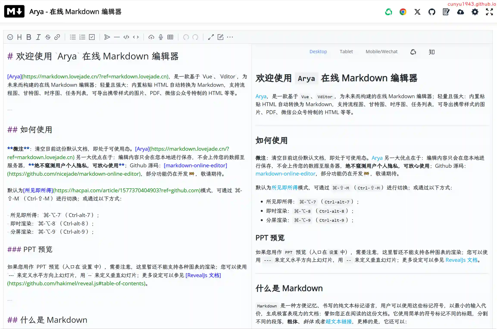
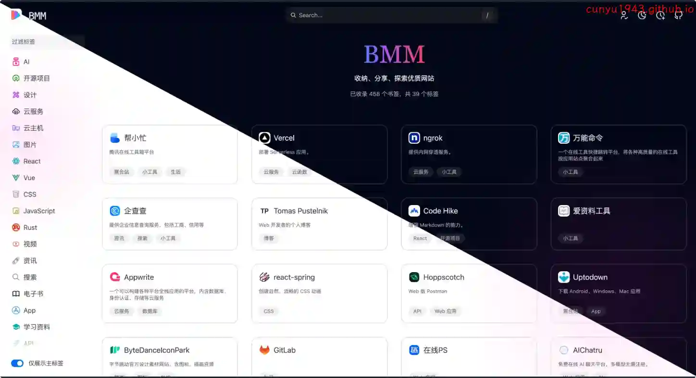
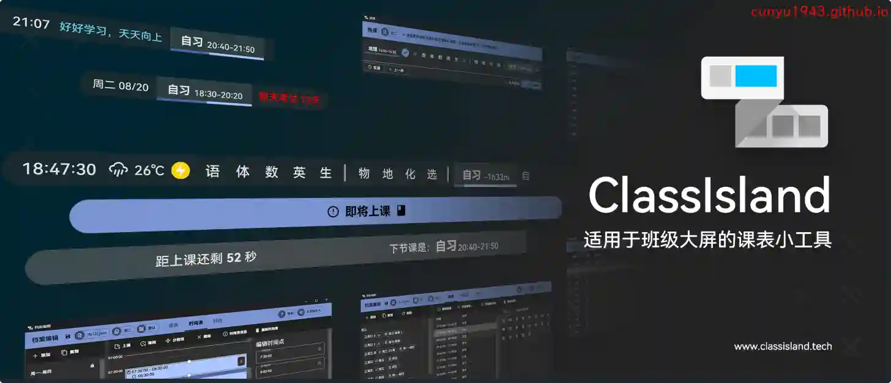
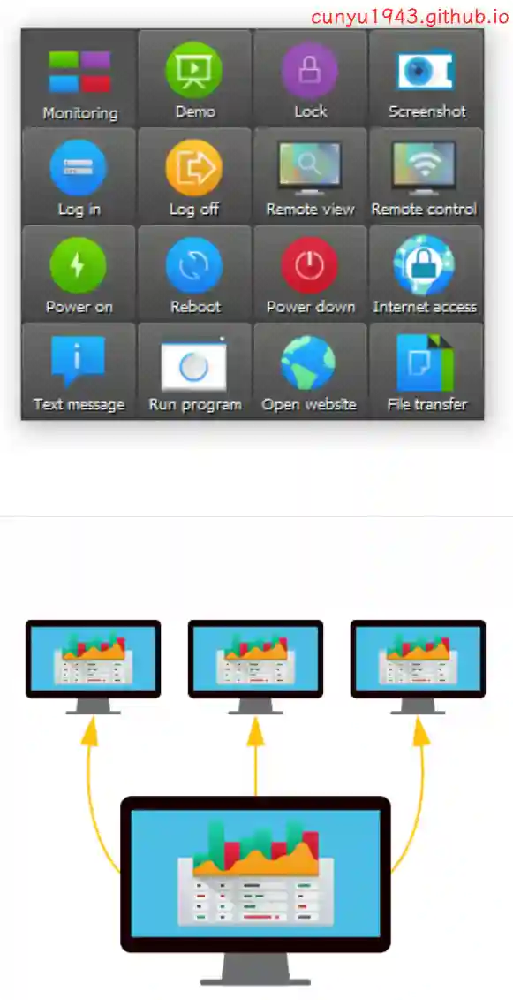
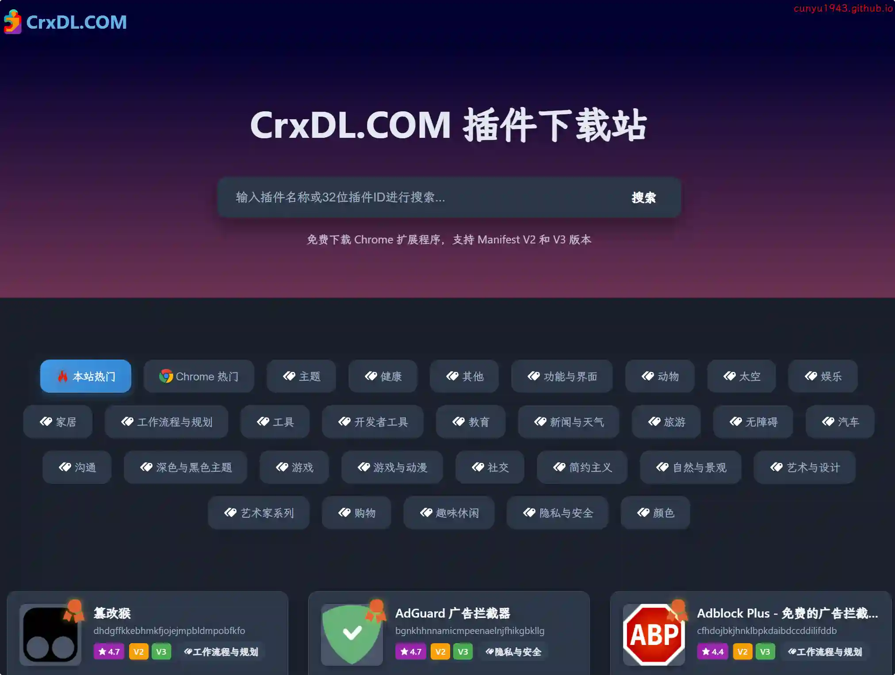
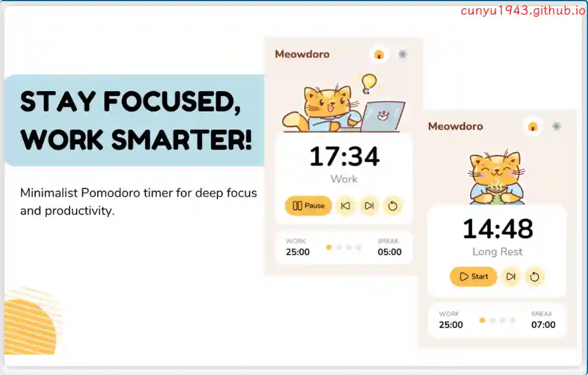
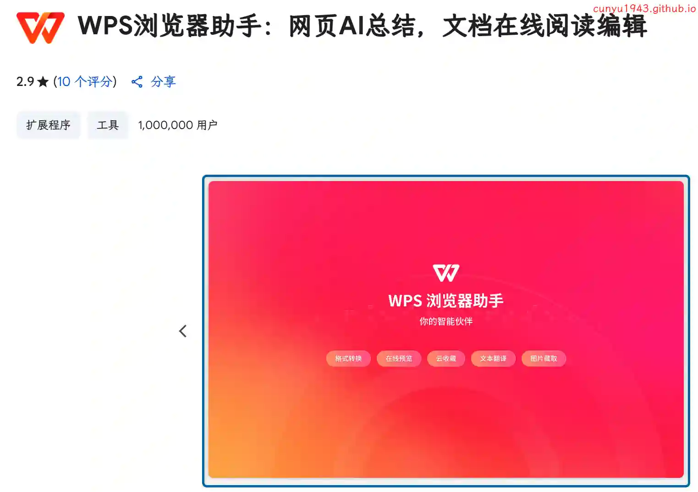
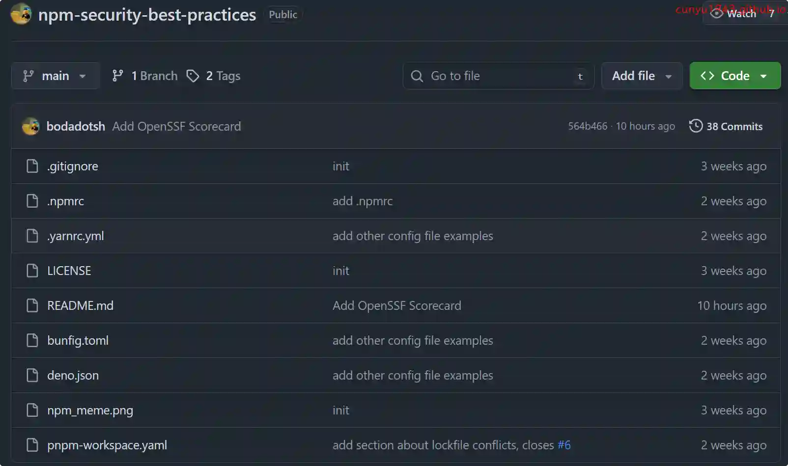
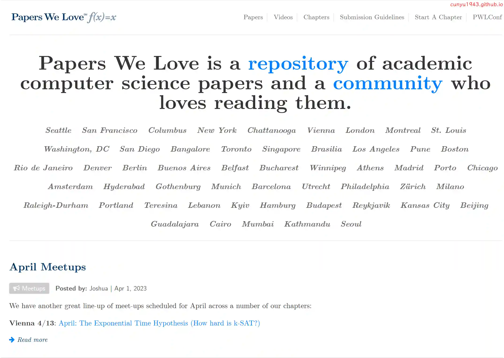

# 好物周刊#126：Papers We Love

> 作者：[村雨遥](https://github.com/cunyu1943)
> 
> 不要哀求，学会争取，若是如此，终有所获
> 
> 原文：https://mp.weixin.qq.com/s/825-s5si6QHryZ9tzZF3ug

## 🎈 号外 

最近，公众号之外，建立了微信交流群，不定期会在群里分享各种资源（影视、IT 编程、考试提升……）&知识。如果有需要，可以**扫码或者后台添加小编微信备注入群**。进群后**优先看群公告**，**呼叫群中【资源分享小助手】**，还能免费帮找资源哦～

## 一、项目

### 1. [Arya - 在线 Markdown 编辑器](https://github.com/nicejade/markdown-online-editor)

基于 Vue2、Vditor，所构建的在线 Markdown 编辑器，支持绘制流程图、甘特图、时序图、任务列表、echarts 图表、五线谱，以及 PPT 预览、视频音频解析、HTML 自动转换为 Markdown 等功能。

### 2. [Hacker News 每日播报](https://github.com/ccbikai/hacker-news)

一个基于 AI 的 Hacker News 中文播客项目，每天自动抓取 Hacker News 热门文章，通过 AI 生成中文总结并转换为播客内容。

### 3. [BMM](https://github.com/Y80/bmm)

收纳、分享、探索优质网站，你的专属书签管家。

## 二、软件

### 1. [ClassIsland](https://github.com/ClassIsland/ClassIsland)

一款适用于班级多媒体屏幕的课表信息显示工具，可以在 Windows 屏幕上显示各种信息。

应用的名字灵感源于 iOS 灵动岛（Dynamic Island）功能。

### 2. [Dayflow](https://github.com/JerryZLiu/Dayflow)

一款用于记录你在 macOS 上活动时间线的原生程序，它以每秒 1 帧的速度记录你的屏幕，每 15 分钟用 AI 进行分析，并生成一个带有摘要的活动时间轴。

### 3. [Veyon](https://github.com/veyon/veyon)

一个免费的开源软件，用于监视和控制跨多个平台的计算机。Veyon 支持您在数字学习环境中进行教学，执行虚拟培训或提供远程支持。

## 三、网站

### 1. [3y 论坛](https://www.3ylt.xyz/view/user/regist?invitationCode=l2jfef95xm)

号称世界上最纯净的网盘资源分享社区，拒绝弹窗和浮动广告。

### 2. [插件下载站](https://crxdl.com)

免费下载 Chrome 插件扩展程序，支持 Manifest V2 和 V3 版本，提供丰富的插件分类和搜索功能。

### 3. [爱 PPT](https://www.2ppt.com)

爱 PPT 模板网提供各类 PPT 模板，PPT 背景图，PPT 素材免费下载。

## 四、插件

### 1. [Meowdoro Tracker](https://chromewebstore.google.com/detail/meowdoro-tracker-pomodoro/gmmcoggmjnbbklphjcbnpfepmagelgkk)

一款基于番茄工作法的扩展程序，以可爱的猫咪为形象，旨在帮助用户提高工作效率，避免过度疲劳。

### 2. [WPS 浏览器助手](https://chromewebstore.google.com/detail/blegnhaaimfcklgddeegngmanbnfopog?utm_source=item-share-cb)

网页 AI 总结，快速划词解释、翻译，AI 写作与生成 PPT，助你轻松办公。

### 3. [BeLikeNative](https://chromewebstore.google.com/detail/belikenative-ai-writing-w/gchojmpfpbpmpfgdppfdkpchikbcgabp)

你的写作，编辑和翻译助手。用 AI 提升你的写作！提供即时释义，翻译，并加强文本使用简单的快捷方式。快速，简单，有效的 AI 工具！

## 五、资料

### 1. [NPM Security Best Practices](https://github.com/bodadotsh/npm-security-best-practices)

针对 npm 软件包投毒事件，仓库收录了各种避免 npm 投毒攻击的安全措施。

### 2. [Papers We Love](https://github.com/papers-we-love/papers-we-love)

一个围绕阅读、讨论和学习更多学术计算机科学论文而建立的社区。这个仓库作为社区可以找到的一些最好论文的目录，将分散在网络上的文档汇集在一起。

### 3. [Show the Physics](https://github.com/FreekPols/ShowthePhysics)

书中精选了荷兰科学教育协会出版的荷兰图书系列“ShowdeFysica”中的 99 个涉及各个领域的物理小实验。

## ✍️ 说明

周刊专栏相关信息：

- **项目地址**：[Github](https://github.com/cunyu1943/weekly)，觉得不错麻烦给我一个**Star**，感谢 ❤️
- **浏览地址**：公众号 | [电子书](https://cunyu1943.github.io/weekly) | [语雀](https://yuque.com/cunyu1943/weekly)

如果你阅读到这里，说明我的工作没有白费。如果你想推荐项目/网站/软件/资源，欢迎提交 **[issue](https://github.com/cunyu1943/weekly/issues)** 或者添加我 **个人微信：coder_cunYu** 与我交流。

---

## ⏳ 联系

想解锁更多知识？不妨关注我的微信公众号：**村雨遥（id：JavaPark）**。

扫一扫，探索另一个全新的世界。

