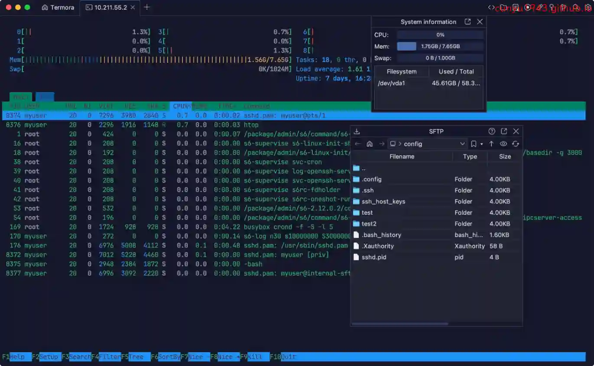
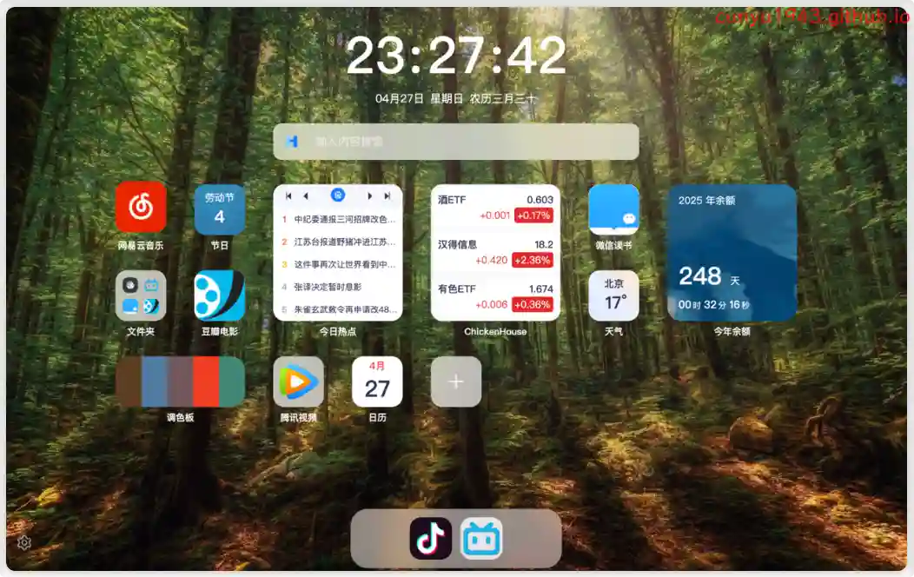
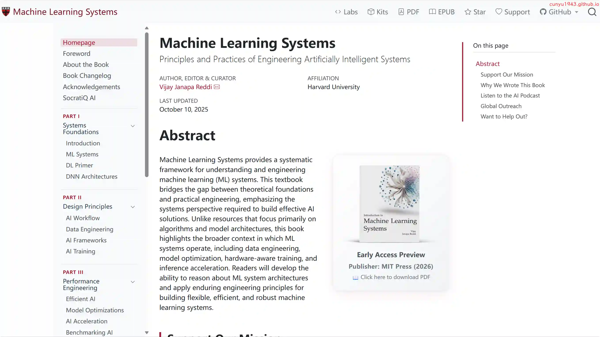
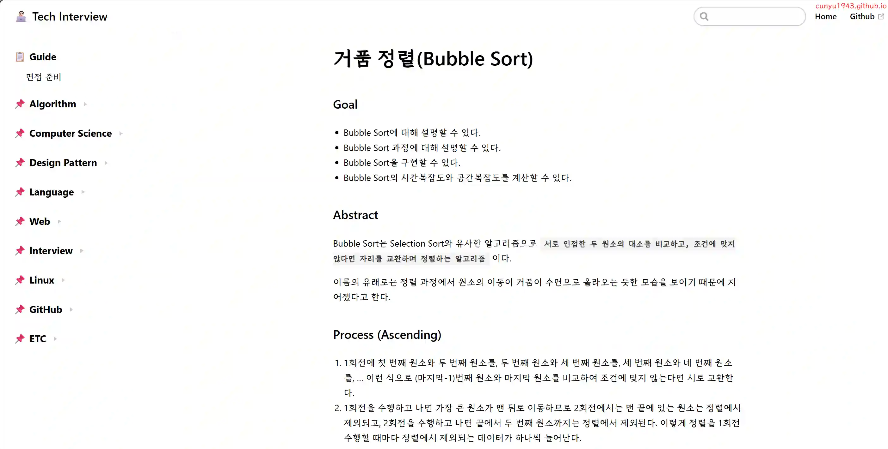

# 好物周刊#127：乡间郎中

> 作者：[村雨遥](https://github.com/cunyu1943)
> 
> 不要哀求，学会争取，若是如此，终有所获
> 
> 原文：https://mp.weixin.qq.com/s/zRCA4frA8tI_hCPab3F4fg

## 🎈 号外 

最近，公众号之外，建立了微信交流群，不定期会在群里分享各种资源（影视、IT 编程、考试提升……）&知识。如果有需要，可以**扫码或者后台添加小编微信备注入群**。进群后**优先看群公告**，**呼叫群中【资源分享小助手】**，还能免费帮找资源哦～

## 一、项目

### 1. [AIMangaStudio](https://github.com/morsoli/aimangastudio)

旨在为独立创作者与工作室提供一套端到端的漫画创作流水线，集成剧情生成、分镜布局、角色设定与页间连续性分析等功能，简化从脚本到漫画页面的制作流程。

### 2. [MoneyPrinterTurbo](https://github.com/harry0703/MoneyPrinterTurbo)

只需提供一个视频主题或关键词 ，就可以全自动生成视频文案、视频素材、视频字幕、视频背景音乐，然后合成一个高清的短视频。

### 3. [SpringBlade 微服务开发平台](https://github.com/chillzhuang/blade-tool)

一个由商业级项目升级优化而来的微服务架构，采用 Spring Boot 3.5 、Spring Cloud 2025 等核心技术构建，完全遵循阿里巴巴编码规范。提供基于 React 和 Vue 的两个前端框架用于快速搭建企业级的 SaaS 多租户微服务平台。

## 二、软件

### 1. [Agora Flat](https://github.com/netless-io/flat)

个人老师可直接使用的在线授课软件，开箱即用。前后端完全开源，快速搭建简约美观的在线教室。

### 2. [Termora](https://github.com/TermoraDev/termora)

一款跨平台终端模拟器和 SSH 客户端，支持 Windows、macOS、Linux。使用 Kotlin/JVM 开发，支持（正在实现中） XTerm 控制序列协议。

### 3. [小猫影视](https://github.com/waifu-project/movie)

一款全平台的影视播放器, 支持 VOD / JS 扩展源。

## 三、网站

### 1. [一糖导航](https://iitang.com)

为广大网民精心筛选、整理国内外各类优秀的网站大全，更多人选择的资源网址导航。

### 2. [轻壁纸](https://qingbizhi.com)

高质量电脑壁纸分享，免费分享电脑壁纸、横屏壁纸、Bing 壁纸等等。

### 3. [乡间郎中](https://www.xjlz365.com)

中医文化，让养生深入你我健康生活，女性、男性、老人、儿童，我们用心让中医养生深入每个国人的点滴生活，更加健康、快乐，养生防病于未然，健康成就你我生活！

## 四、插件

### 1. [HaoTab 新标签页](https://chromewebstore.google.com/detail/fcmpijobelbhgbakdffgjohkddigbiap?utm_source=item-share-cb)

一款多功能的新标签页插件，让你自由打造高颜值主页，丰富多彩的小组件可供选择、精美的界面和便捷的功能体验。采用 iOS 风格的小组件卡片设计，内置 ChickenHouse、 节日、天气、热搜等实用功能，让信息一目了然，标签页整洁美观。

### 2. [弹幕任何地方](https://chromewebstore.google.com/detail/danmaku-anywhere/jnflbkkmffognjjhibkjnomjedogmdpo?hl=zh)

一个可以在几乎任何视频网站上加载弹幕的浏览器扩展，让你看番不再寂寞。

### 3. [Email Signature Generator by cloudHQ](https://chromewebstore.google.com/detail/email-signature-generator/adabkammndnejioekmmdhgdnlfenpkci?hl=zh-CN)

cloudHQ 提供的免费电子邮件签名生成器和签名模板。

## 五、资料

### 1. [Prompt Engineering Interactive Tutorial](https://github.com/anthropics/prompt-eng-interactive-tutorial)

该教程旨在帮你一步一步理解如何用 Claude 设计最佳提示语，通过学习该课程，你应该能够掌握：

-   好的提示语的基本机构
-   常见失败模式
-   Claude 优缺点
-   ……

### 2. [Machine Learning Systems](https://github.com/harvard-edge/cs249r_book)

开源机器学习系统入门数据，最初在哈佛大学的 CS249r 课程中使用，现在被许多大学当做教材。

### 3. [tech-interview-for-developer](https://github.com/gyoogle/tech-interview-for-developer)

面向入门开发者的专业知识与技术面试百科，不过是韩文的，适合能读懂韩文的朋友。

## ✍️ 说明

周刊专栏相关信息：

- **项目地址**：[Github](https://github.com/cunyu1943/weekly)，觉得不错麻烦给我一个**Star**，感谢 ❤️
- **浏览地址**：公众号 | [电子书](https://cunyu1943.github.io/weekly) | [语雀](https://yuque.com/cunyu1943/weekly)

如果你阅读到这里，说明我的工作没有白费。如果你想推荐项目/网站/软件/资源，欢迎提交 **[issue](https://github.com/cunyu1943/weekly/issues)** 或者添加我 **个人微信：coder_cunYu** 与我交流。

---

## ⏳ 联系

想解锁更多知识？不妨关注我的微信公众号：**村雨遥（id：JavaPark）**。

扫一扫，探索另一个全新的世界。

