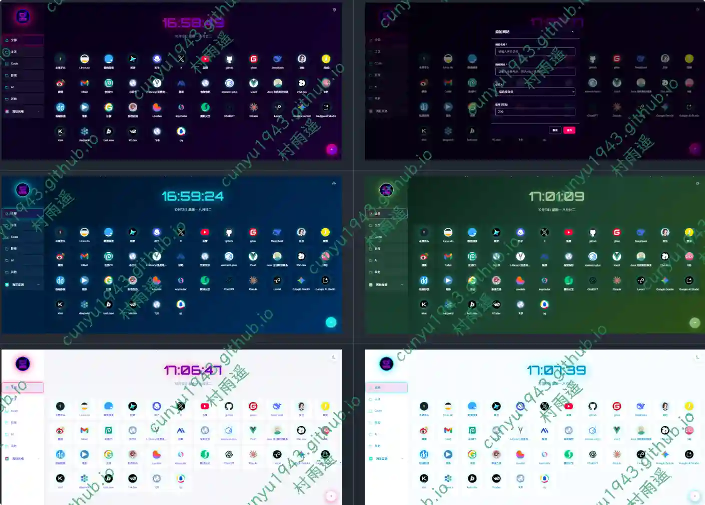
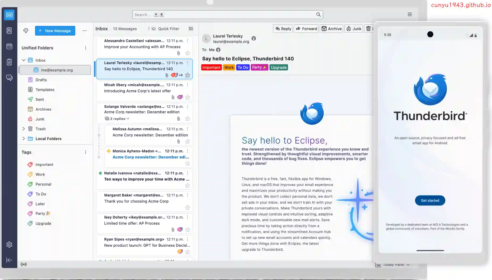
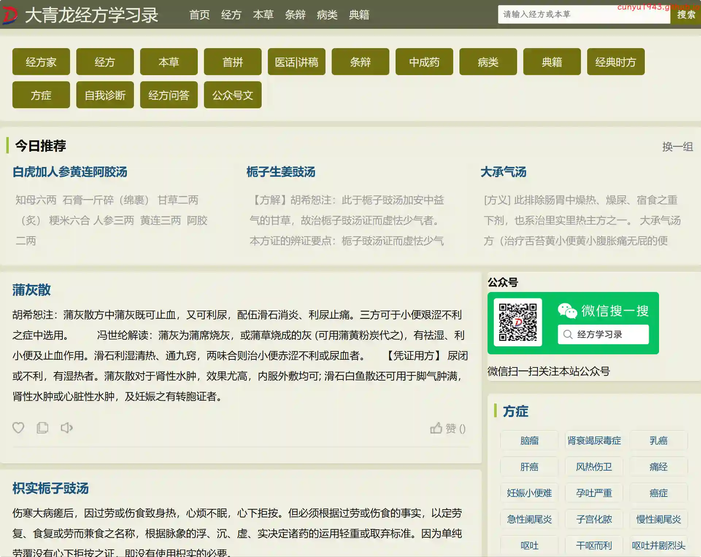
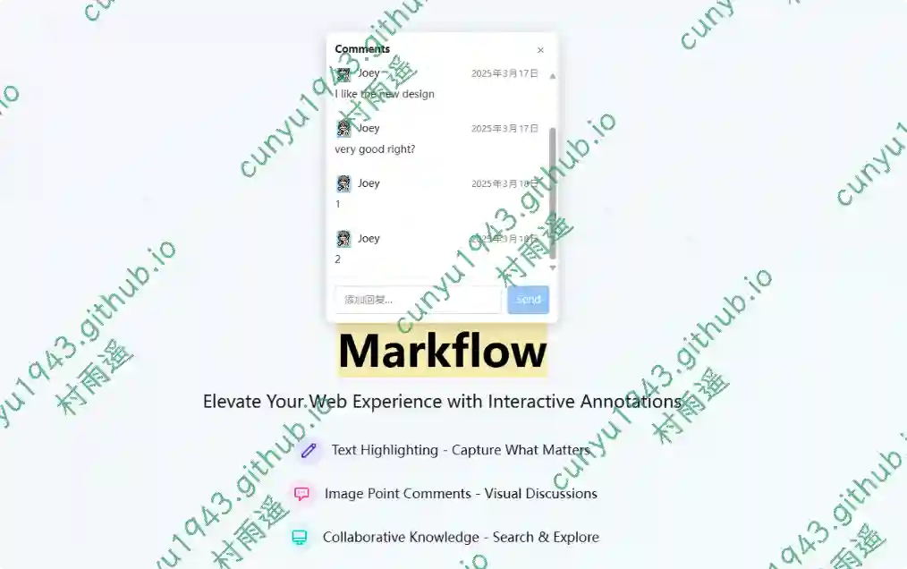
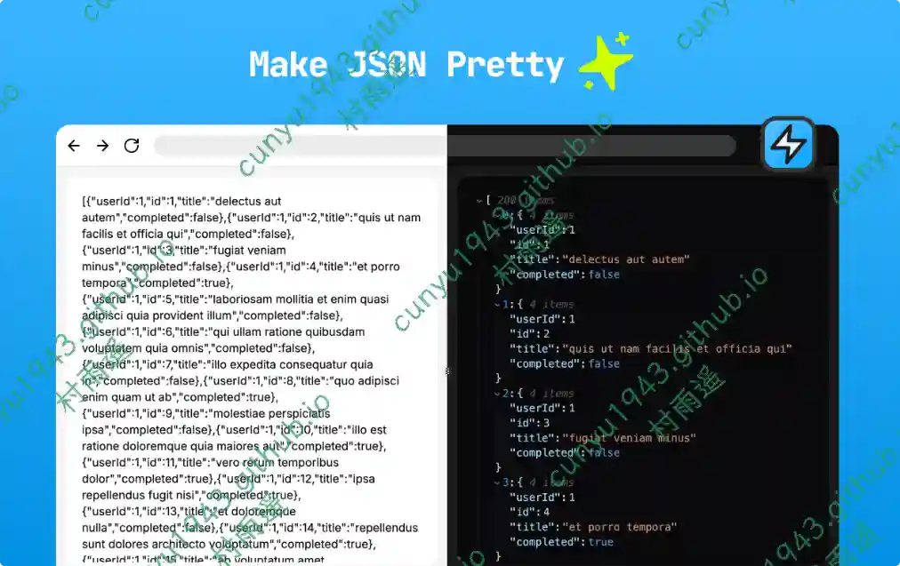
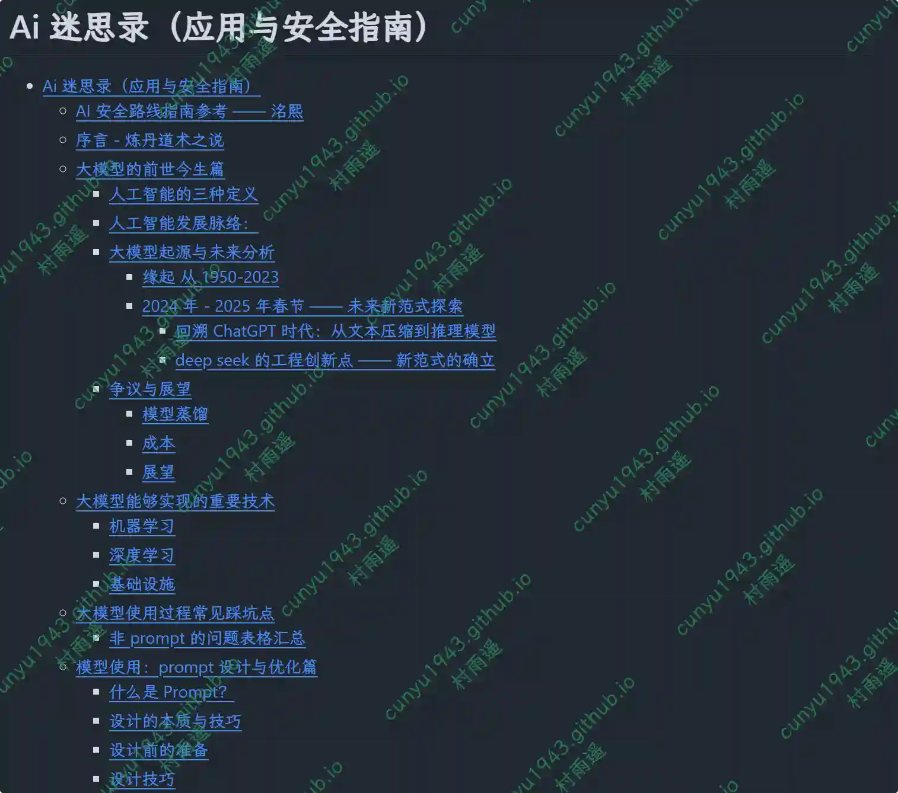
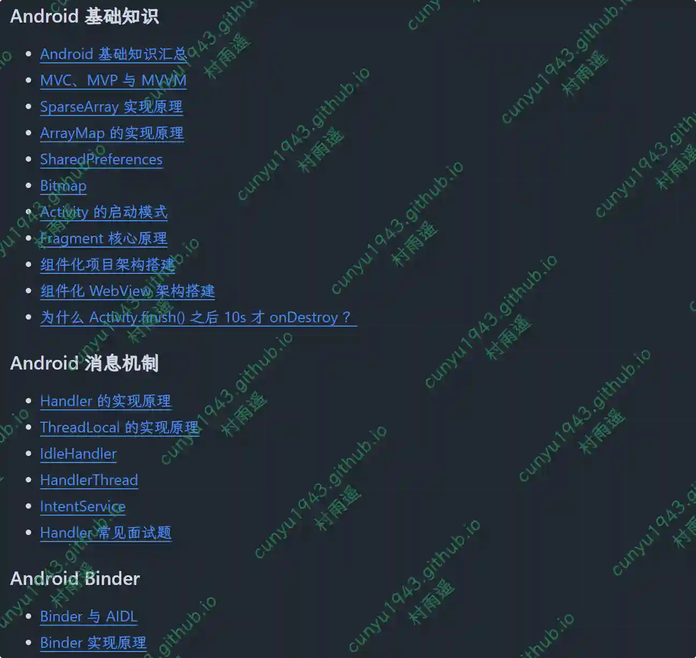

# 好物周刊#130：大图居

> 作者：[村雨遥](https://github.com/cunyu1943)
> 
> 不要哀求，学会争取，若是如此，终有所获
> 
> 原文：https://mp.weixin.qq.com/s/1vUhyu3ioP80Q5fkWq9b6w

## 🎈 号外 

最近，公众号之外，建立了微信交流群，不定期会在群里分享各种资源（影视、IT 编程、考试提升……）&知识。如果有需要，可以**扫码或者后台添加小编微信备注入群**。进群后**优先看群公告**，**呼叫群中【资源分享小助手】**，还能免费帮找资源哦～

## 一、项目

### 1. [打滑作业平台](https://github.com/cubewhy/skid-homework)

开源 AI 家庭作业解答器, 为自学者节省时间的学习平台。

### 2. [水果导航](https://github.com/wubh2012/navsite)

一个基于飞书多维表格数据的导航网站。

### 3. [中国节假日](https://github.com/vsme/chinese-days)

项目提供了一系列用于查询中国节假日、调休日、工作日、24 节气、以及农历阳历互转的函数，提供 JSON 文件，此外还支持 iCal 文件订阅节假日，可供 Google Calendar、Apple Calendar、Microsoft Outlook 等客户端订阅。

## 二、软件

### 1. [ThunderBird](https://www.thunderbird.net)

借助这款迅捷的应用，来一站式查看邮件、日历、联系人，随心筛选和整理项目，并且可以选择是分别打理各个账户，还是合并到一个收件箱。

### 2. [Aictionary](https://github.com/ahpxex/Aictionary)

一个桌面词典：快速、简洁，并且真的让你学会英语。

### 3. [AiPy](https://github.com/knownsec/aipyapp)

中文名爱派，用 Python Use，给 AI 装上双手，开放源码、本地部署，除了帮你思考，更能帮你干活，成为您的超级人工智能助手！从此，你只要说出你的想法，爱派帮你分析本地数据，操作本地应用，给你最终结果！

## 三、网站 

### 1. [大青龙经方学习录](https://www.daqinglong.com)

一个中医爱好者收集、学习中医经典名方和传统中医知识的感悟、心得记录。

### 2. [大图居](https://www.datuju.com)

收录了最好看的美女图片、高清手机壁纸，是壁纸爱好者必备的网站。

### 3. [千盒工具](https://1000tool.com)

专注优质在线工具。视频工具、音频工具、图片工具、 PDF 工具、办公辅助、设计工具、文本工具、数字工具、单位转换等工具。拥有良好的用户体验，提升您的工作学习效率！

## 四、插件

### 1. [公众号内容编辑器](https://chromewebstore.google.com/detail/cckggnbnimdbbpmdinkkgbbncopbloob?utm_source=item-share-cb)

一款高度简洁的微信 Markdown 编辑器：支持 Markdown 语法、自定义主题样式、内容管理、多图床、AI 助手等特性。

### 2. [Markflow](https://chromewebstore.google.com/detail/markflow/efkfidaggnnbhkdiojgljaoobdmiafam)

用交互式注释提升您的 Web 体验，支持网页内容评论和高亮。

### 3. [JSON 美化](https://chromewebstore.google.com/detail/json-pretty/nflbalmkceonkkhifbifebanhladdgcp)

一个强大的 JSON 格式化和美化工具，便于数据的可读性，专为网页开发者、数据分析师等设计。

## 五、资料

### 1. [Awesome-MCP-ZH](https://github.com/yzfly/Awesome-MCP-ZH)

一个专为中文用户打造的 MCP（模型上下文协议）资源合集！ 这里有 MCP 的基础介绍、玩法、客户端、服务器和社区资源，帮你快速上手这个 AI 界的 “万能插头”。

### 2. [Ai 迷思录](https://github.com/Acmesec/theAIMythbook)

项目旨在帮助您从零基础成长为具备实战能力的人工智能安全专家。本指南涵盖了基础知识、法律法规、经典 AI 模型、漏洞与攻击、防御方法、安全开发与运维、相关框架、会议讲座以及实践实验室等多个方面，并为每个层级提供了的学习建议和资源。

### 3. [AndroidNote](https://github.com/zhpanvip/AndroidNote)

记录作者的个人学习笔记，Android 面试指南。

## ✍️ 说明

周刊专栏相关信息：

- **项目地址**：[Github](https://github.com/cunyu1943/weekly)，觉得不错麻烦给我一个**Star**，感谢 ❤️
- **浏览地址**：公众号 | [电子书](https://cunyu1943.github.io/weekly) | [语雀](https://yuque.com/cunyu1943/weekly)

如果你阅读到这里，说明我的工作没有白费。如果你想推荐项目/网站/软件/资源，欢迎提交 **[issue](https://github.com/cunyu1943/weekly/issues)** 或者添加我 **个人微信：coder_cunYu** 与我交流。

---

## ⏳ 联系

想解锁更多知识？不妨关注我的微信公众号：**村雨遥（id：JavaPark）**。

扫一扫，探索另一个全新的世界。

