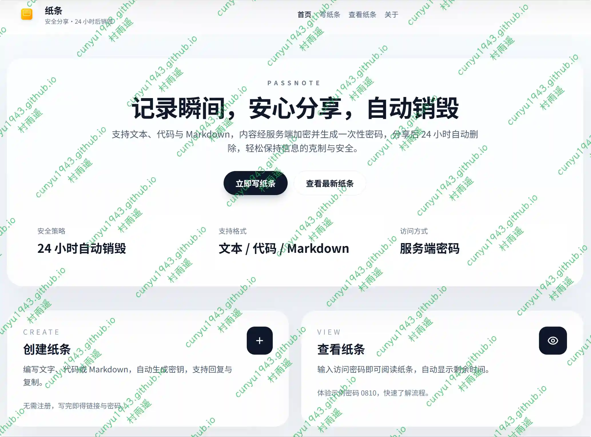
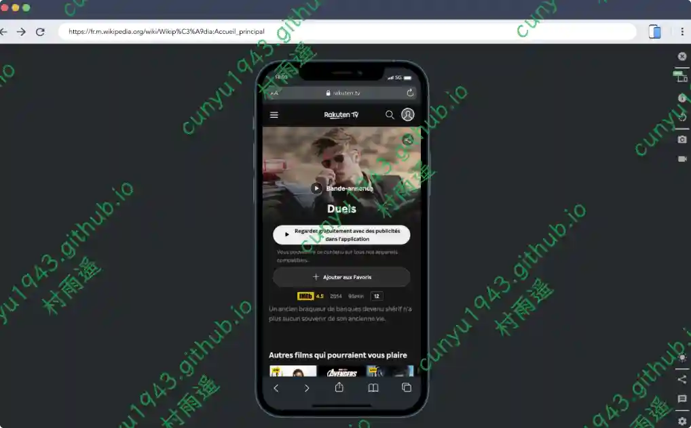
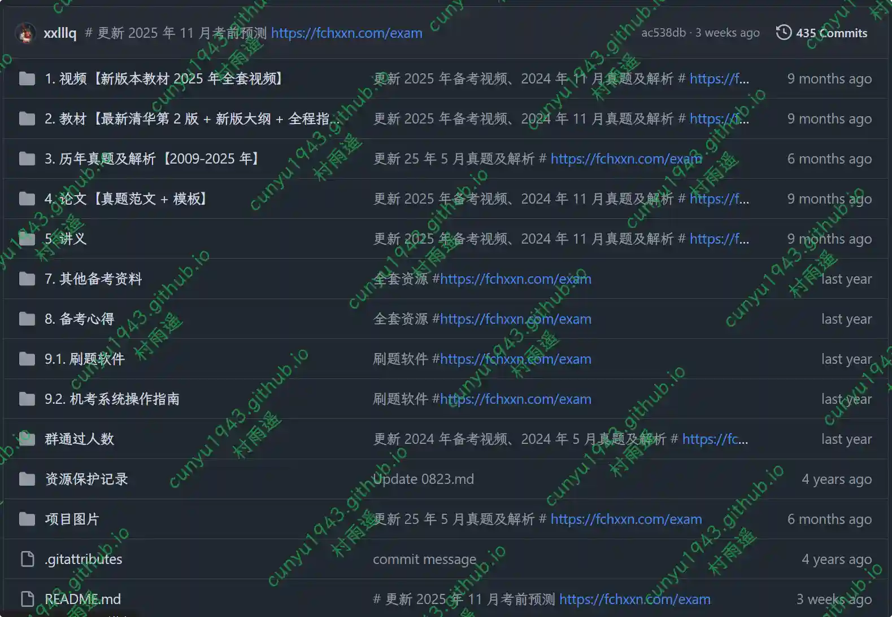

# 好物周刊#132：闪电说

> 作者：[村雨遥](https://github.com/cunyu1943)
> 
> 不要哀求，学会争取，若是如此，终有所获
> 
> 原文：https://mp.weixin.qq.com/s/Wj4Y1FSZULZ6sCAaM0Akfg

## 🎈 号外 

最近，公众号之外，建立了微信交流群，不定期会在群里分享各种资源（影视、IT 编程、考试提升……）&知识。如果有需要，可以**扫码或者后台添加小编微信备注入群**。进群后**优先看群公告**，**呼叫群中【资源分享小助手】**，还能免费帮找资源哦～

## 一、项目

### 1. [Brook](https://github.com/g-brook/brook)

一款跨平台（Linux / macOS / Windows）的高性能网络隧道与代理工具，使用 Go 语言编写。 支持 TCP、UDP、HTTP (S)、WebSocket 等隧道传输方式，兼容 SSH、HTTP、Redis、MySQL 等主流协议，并提供直观的可视化管理界面，便于配置与监控。

### 2. [YPrompt](https://github.com/fish2018/YPrompt)

AI 通过对话挖掘用户需求，并自动生成专业的提示词，支持系统 / 用户提示词优化、效果对比，版本管理和支持即时渲染的操练场。

### 3. [马良 AI 写作](https://github.com/Deng-m1/MaliangAINovalWriter)

基于 Flutter (Web) + Spring Boot 的专业 AI 小说创作平台，集成先进 AI 模型，提供从内容创作、世界观构建到平台运维的完整工具链。

## 二、软件

### 1. [闪电说](https://shandianshuo.cn)

闪电说 AI 语音输入法，比打字快  4倍。支持 AI 对话、AI 编程、文档创作、聊天回复，所有应用都支持语音输入。

### 2. [豆包输入法](https://shurufa.doubao.com)

字节跳动旗下输入法，集成了先进好用的豆包语音能力，支持多种方言精准识别、智能纠错及轻声输入。同时键盘输入有强大的纠错、长输入能力与结合上下文的智能联想，让输入法成为你最好的输入。

### 3. [追创作](https://dreamapp.cc/zh-CN)

为视频创作者打造的一站式素材获取、字幕润色与跨语言交付工具。

## 三、网站

### 1. [观沧海](https://ageeye.app.ditushu.com)

在这里共享你的知识地图，除此之外还支持在线编辑地图。

### 2. [iFixit](https://zh.ifixit.com)

一个以维修为主题的全球性互助社区。从一个一个的设备开始，让我们来一步一个脚印一点一点的修复这个世界。你可以在问题解答论坛和专家一起互动，还可以创建并与全世界分享由你编篡的维修手册。你可以在这里买到所有关于你的 DIY 维修计划的配件及工具，帮助修复好你的苹果或安卓设备。

### 3. [纸条](https://n.showmsg.cn)

支持文本、代码与 Markdown，内容经服务端加密并生成一次性密码，分享后 24 小时自动删除，轻松保持信息的克制与安全。

## 四、插件

### 1. [AnyDoc翻译器](https://chromewebstore.google.com/detail/anydoc-translator-transla/aopddeflghjljihihabdclejbojaomaf)

免费 AI 翻译插件，快速、准确，完美保留排版。支持网页、文档、文本和视频双语字幕翻译，支持 ChatGPT、Deepseek、Gemini 等多种 AI 模型。无论是学习、科研还是浏览外语视频，都能轻松应对。

### 2. [手机模拟器](https://chromewebstore.google.com/detail/mobile-simulator-responsi/ckejmhbmlajgoklhgbapkiccekfoccmk)

在电脑上模拟智能手机和平板电脑，提供多种型号以测试您的移动网站和响应式网站。在多种设备上检查显示效果，为客户创建令人印象深刻的演示，并在测试中节省时间。

### 3. [谷歌翻译 - 侧面板](https://chromewebstore.google.com/detail/google-translate-side-pan/lopnbnfpjmgpbppclhclehhgafnifija)

在侧面板中打开 Google 翻译，除此之外，您还可以快速：

-   翻译所选单词
-   翻译选定文本
-   翻译整个网页
-   翻译图片
-   翻译文档

## 五、资料

### 1. [AI 精准操作手册：从 Prompt 工程到认知导航](https://github.com/1Haschwalth/prompt-engineering)

书中汇集了作者操作 deepseek 等模型的一手经验，将看似神秘的“提示词技巧”系统化为可学习、可复用的方法论。无论你是学生、创作者、开发者还是企业家，这些方法都能帮你把AI转化为持续的竞争优势。

### 2. [Llama 中文社区](https://github.com/LlamaFamily/Llama-Chinese)

Llama 中文社区，实时汇总最新 Llama 学习资料，构建最好的中文 Llama 大模型开源生态，完全开源可商用。

### 3. [系统架构设计师复习资料](https://github.com/xxlllq/system_architect)

2025 年系统架构设计师（软考高级）备考资料，项目从 2018 年免费更新维护至今，已帮助大量备考者以最低成本、最短时间顺利通过考试。

## ✍️ 说明

周刊专栏相关信息：

- **项目地址**：[Github](https://github.com/cunyu1943/weekly)，觉得不错麻烦给我一个**Star**，感谢 ❤️
- **浏览地址**：公众号 | [电子书](https://cunyu1943.github.io/weekly) | [语雀](https://yuque.com/cunyu1943/weekly)

如果你阅读到这里，说明我的工作没有白费。如果你想推荐项目/网站/软件/资源，欢迎提交 **[issue](https://github.com/cunyu1943/weekly/issues)** 或者添加我 **个人微信：coder_cunYu** 与我交流。

---

## ⏳ 联系

想解锁更多知识？不妨关注我的微信公众号：**村雨遥（id：JavaPark）**。

扫一扫，探索另一个全新的世界。

