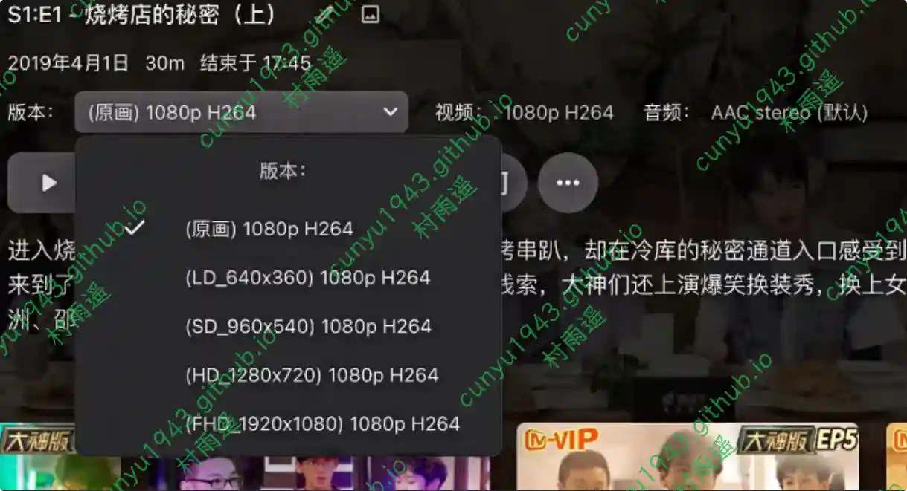
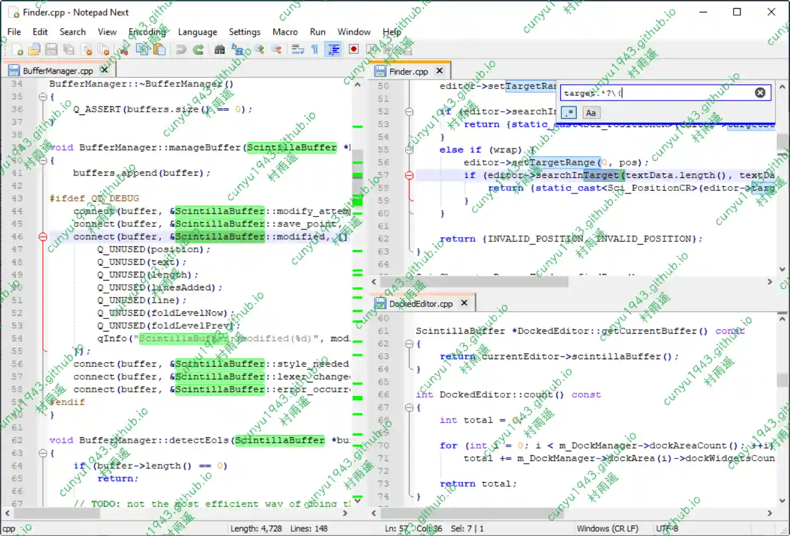
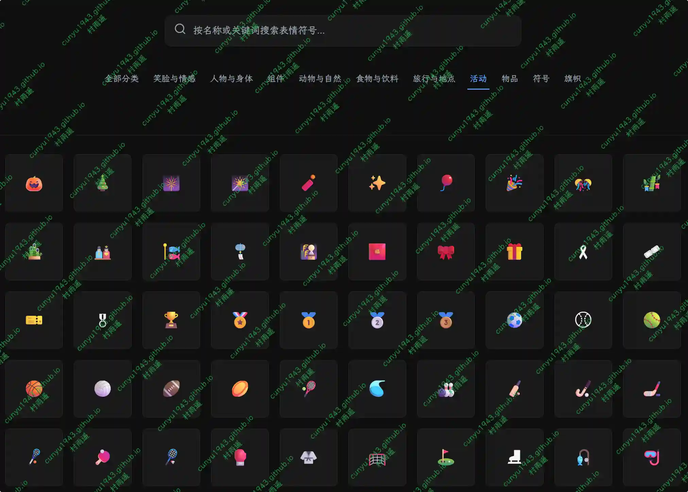
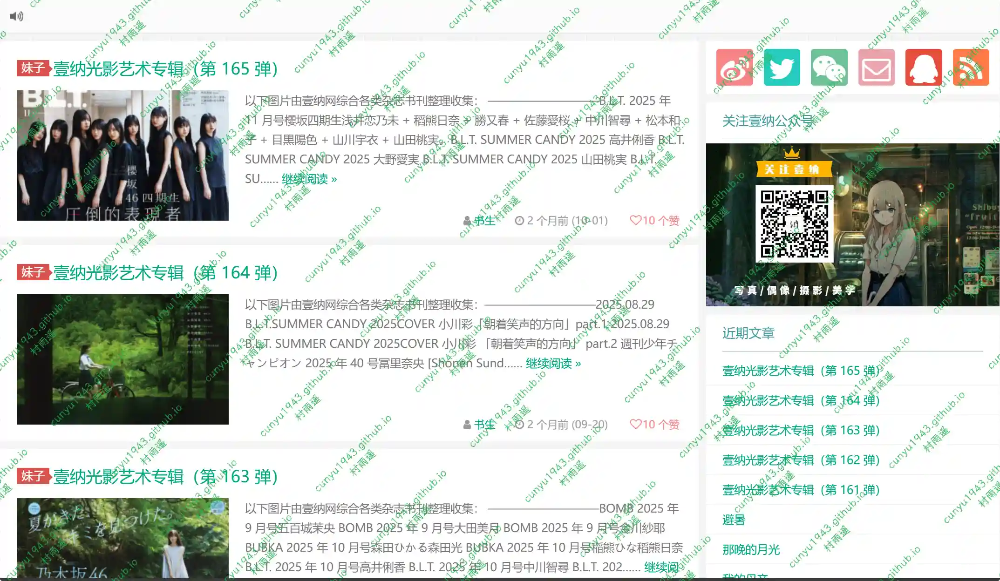
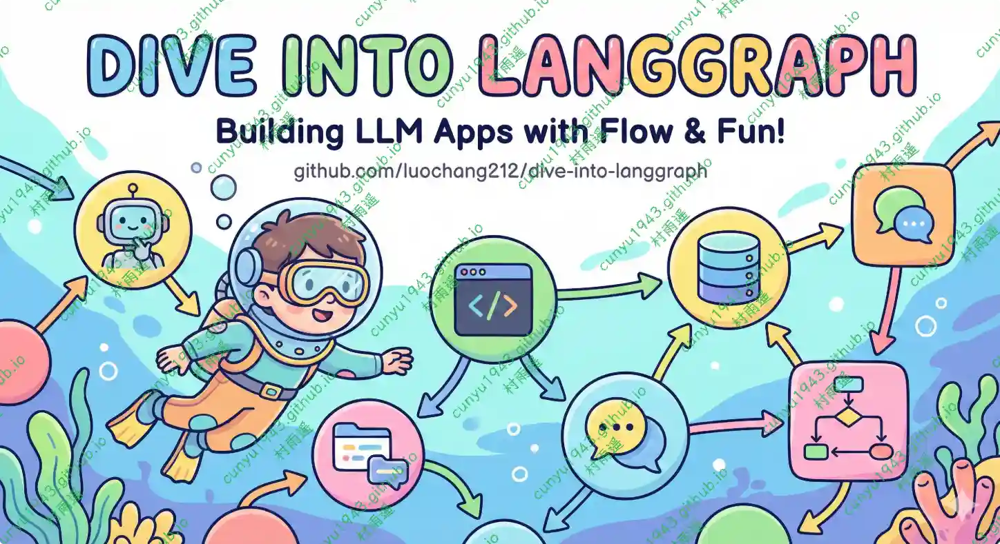
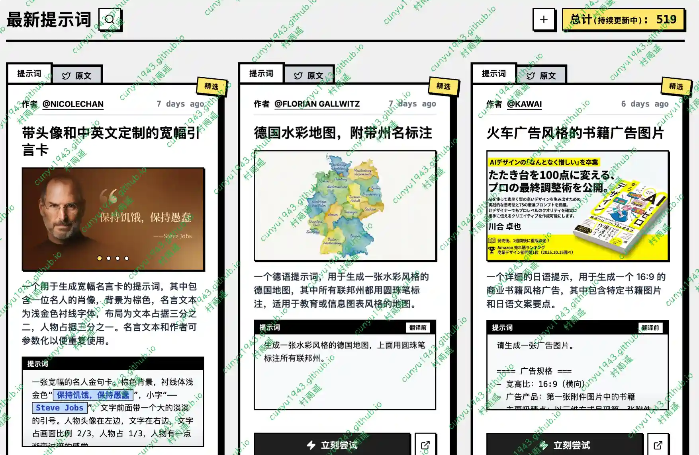
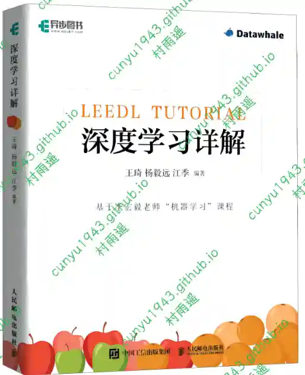

# 好物周刊#133：油桃 TV

> 作者：[村雨遥](https://github.com/cunyu1943)
> 
> 不要哀求，学会争取，若是如此，终有所获
> 
> 原文：https://mp.weixin.qq.com/s/jvG9Za8bZU0FAu75367u6A

## 🎈 号外 

最近，公众号之外，建立了微信交流群，不定期会在群里分享各种资源（影视、IT 编程、考试提升……）&知识。如果有需要，可以**扫码或者后台添加小编微信备注入群**。进群后**优先看群公告**，**呼叫群中【资源分享小助手】**，还能免费帮找资源哦～

## 一、项目

### 1. [MediaWarp](https://github.com/AkimioJR/MediaWarp)

前置于 EmbyServer / Jellyfin 的反向代理服务器，修改了原媒体服务器返回响应以实现特殊功能。优化播放 Strm 文件、自定义前端样式、自定义允许访问客户端、嵌入脚本，推荐配合 AutoFilm 使用。

### 2. [go-emby2openlist](https://github.com/AmbitiousJun/go-emby2openlist)

Go 语言编写的 Emby + OpenList (Alist) 网盘直链反向代理服务，深度适配阿里云盘转码播放，支持 OpenList 本地目录树生成，配置简单，DockerCompose 一键部署。

### 3. [NodeBBS](https://github.com/aiprojecthub/nodebbs)

一个基于 Turborepo 单体仓库架构构建的现代化、高性能论坛平台，采用 GitHub Issue 风格设计。

## 二、软件

### 1. [剪存](https://github.com/snsogbl/clip-save)

一个基于 Wails + Vue 3 + TypeScript 的跨平台剪贴板历史管理工具。

### 2. [NotepadNext](https://github.com/dail8859/NotepadNext)

一款开源免费的文本编辑器，基于 Notepad++ 同时优化增强了部分功能，支持 Windows、macOS 平台。

### 3. [油桃 TV](https://github.com/VonChange/utao)

专为电视投影等大屏设备设计的一个第三方浏览器，可绕过某些平台限制，让用户在电视上更便捷和低成本的观看视频。

## 三、网站

### 1. [Emojizen](https://emojizen.com)

发现、搜索并一键复制精美表情符号。

### 2. [好拼](https://img.ops-coffee.com/photo)

一款强大的免费在线拼图工具，支持多种网格布局和自定义长图拼接，无水印免登录直接下载，帮你轻松创作个性化照片。

### 3. [壹纳网](https://yinaw.com)

一个小而美的站点，主要展示日系摄影，也分享一些有意义的社会杂文，这里感激和崇尚一切美的事物。

## 四、插件

### 1. [Listly - 网页数据采集](https://chromewebstore.google.com/detail/listly-web-scraping/ihljmnfgkkmoikgkdkjejbkpdpbmcgeh)

免费易用的网页数据采集工具，只需点击几下，即可将任何网站转换为 Excel。加快您的数据收集速度，将时间和精力投入到真正重要的事情上。

### 2. [Better History](https://chromewebstore.google.com/detail/better-history-manage-exp/egehpkpgpgooebopjihjmnpejnjafefi)

简洁的历史记录管理器：强大的搜索、批量导出、删除自定义选择、按日和小时筛选，以及从历史记录中阻止特定域名。

### 3. [Instagram 下载器](https://chromewebstore.google.com/detail/eebdacbalehoojfbinomkiobfepmdkhi?utm_source=item-share-cb)

下载 Instagram 照片、视频、Reels、限时动态和 IGTV，支持单个和批量下载。内置 ChatGPT 的 Instagram AI 助手。

## 五、资料

### 1. [Dive into LangGraph](https://github.com/luochang212/dive-into-langgraph)

LangGraph 是由 LangChain 团队开发的开源智能体框架，责工作流和状态管理，仓库着重介绍该框架的实践。

### 2. [Nano Banana Pro 提示词大全](https://github.com/YouMind-OpenLab/awesome-nano-banana-pro-prompts)

Google Nano Banana Pro 创意提示词精选集合。

### 3. [李宏毅深度学习教程](https://github.com/datawhalechina/leedl-tutorial)

教程主要内容源于《机器学习》（2021 年春），并在其基础上进行了一定的原创。比如，为了尽可能地降低阅读门槛，笔者对这门公开课的精华内容进行选取并优化，对所涉及的公式都给出详细的推导过程，对较难理解的知识点进行了重点讲解和强化，以方便读者较为轻松地入门。

## ✍️ 说明

周刊专栏相关信息：

- **项目地址**：[Github](https://github.com/cunyu1943/weekly)，觉得不错麻烦给我一个**Star**，感谢 ❤️
- **浏览地址**：公众号 | [电子书](https://cunyu1943.github.io/weekly) | [语雀](https://yuque.com/cunyu1943/weekly)

如果你阅读到这里，说明我的工作没有白费。如果你想推荐项目/网站/软件/资源，欢迎提交 **[issue](https://github.com/cunyu1943/weekly/issues)** 或者添加我 **个人微信：coder_cunYu** 与我交流。

---

## ⏳ 联系

想解锁更多知识？不妨关注我的微信公众号：**村雨遥（id：JavaPark）**。

扫一扫，探索另一个全新的世界。

