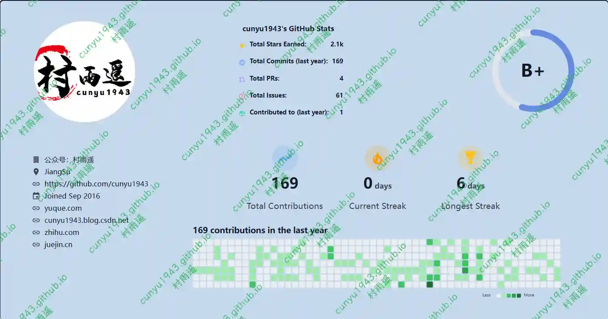
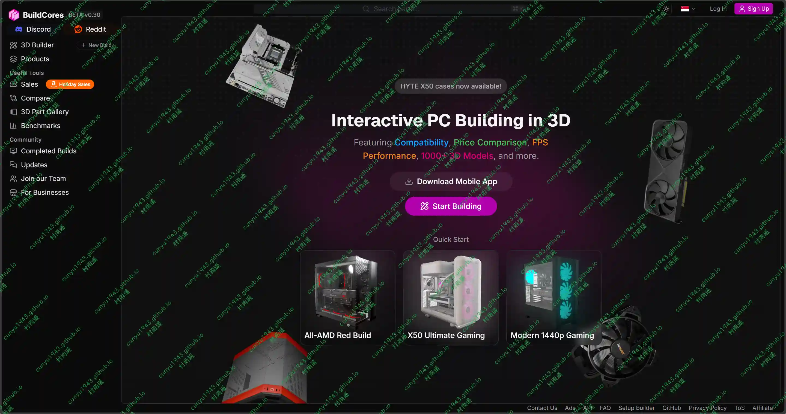
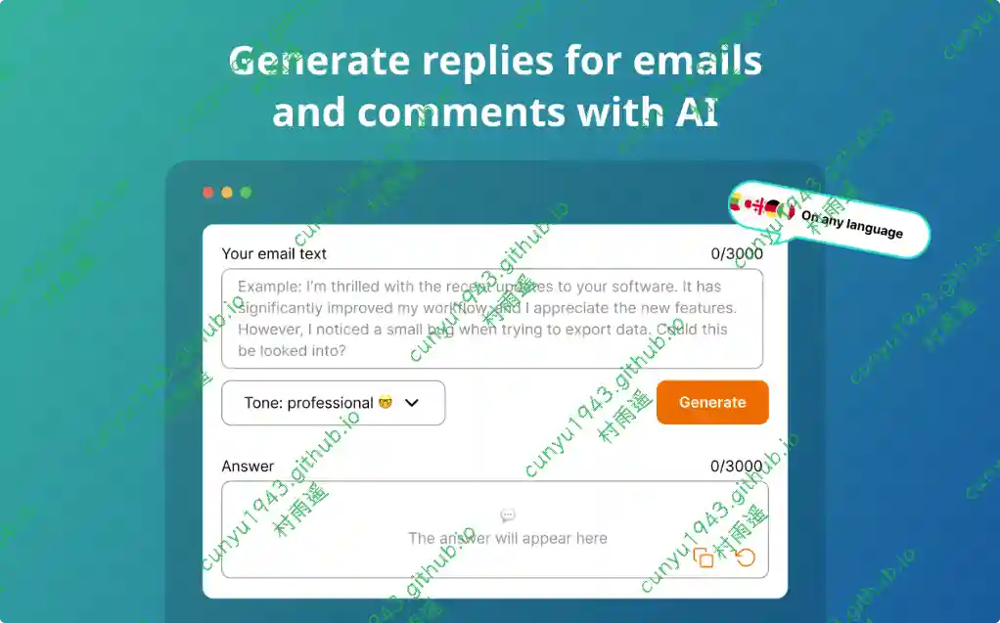
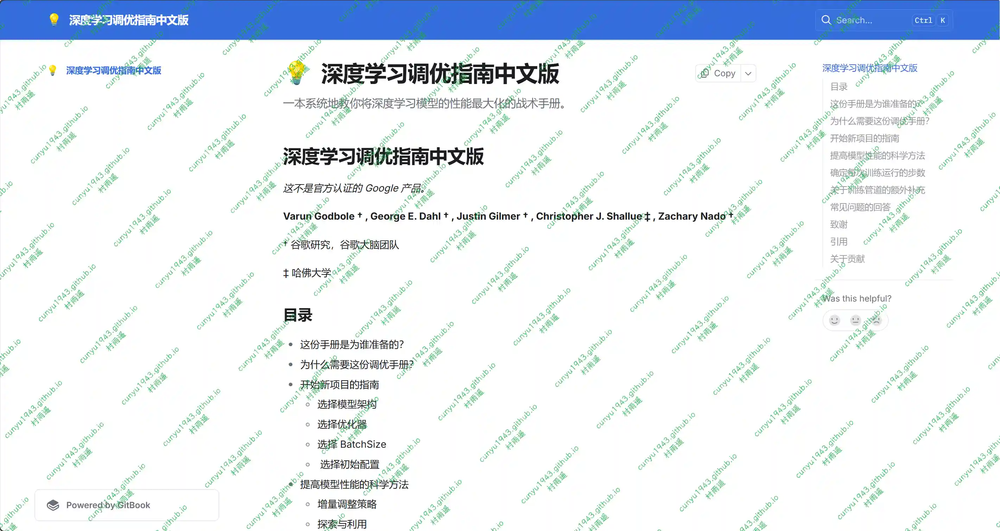
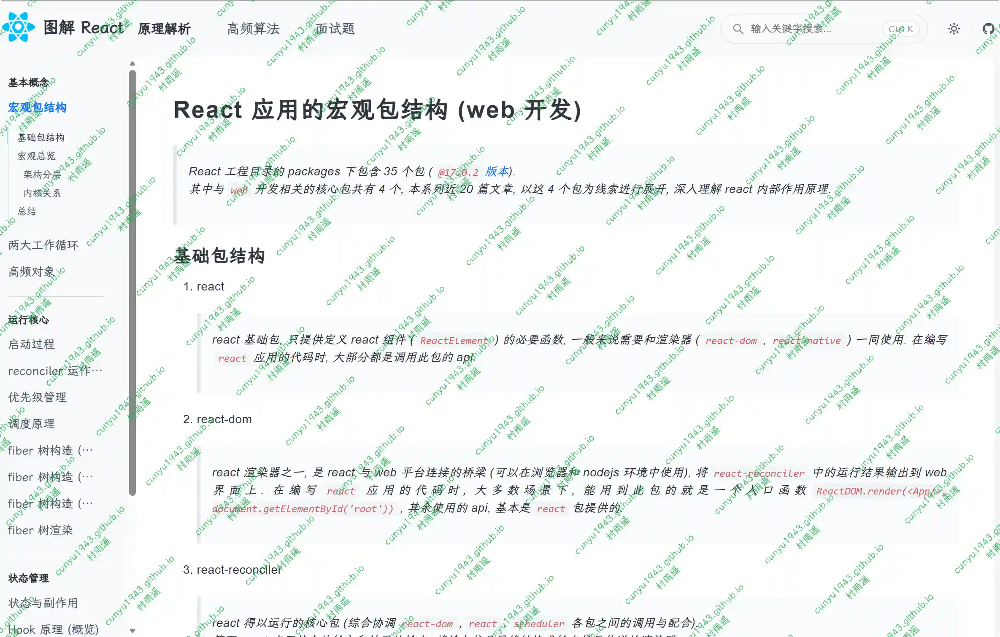
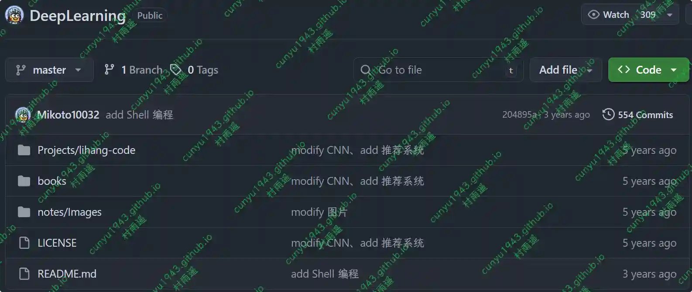

# 好物周刊#134：日历清单

> 作者：[村雨遥](https://github.com/cunyu1943)
> 
> 不要哀求，学会争取，若是如此，终有所获
> 
> 原文：https://mp.weixin.qq.com/s/17XvNwC1EwppSzCrm3697w

## 🎈 号外 

最近，公众号之外，建立了微信交流群，不定期会在群里分享各种资源（影视、IT 编程、考试提升……）&知识。如果有需要，可以**扫码或者后台添加小编微信备注入群**。进群后**优先看群公告**，**呼叫群中【资源分享小助手】**，还能免费帮找资源哦～

## 一、项目

### 1. [玉桃文飨轩](https://github.com/nicejade/markdown2png)

专业的文本转图片工具。一键将 Markdown 转换为精美图片，支持书摘模式、自定义主题、字体和背景。所有数据本地处理保障隐私安全，完美适配多端展示。让文章分享、读书笔记、社交传播更有格调。 基于 Vue3、Vite、Pinia、TailwindCSS、TypeScript 等技术栈构建。

### 2. [code996](https://github.com/hellodigua/code996)

一个分析工具，它可以统计 Git 项目的 commit 时间分布，进而推导出项目的编码工作强度。它可以帮助你了解新团队工作的时间模式，识别潜在的加班文化。

### 3. [seekdb](https://github.com/oceanbase/seekdb)

OceanBase 打造的一款开发者友好的 AI 原生数据库产品，专注于为 AI 应用提供高效的混合搜索能力。它支持向量、文本、结构化与半结构化数据的统一存储与检索，并通过内置 AI Functions 支持数据嵌入、重排与库内实时推理。seekdb 在继承 OceanBase 核心引擎高性能优势与 MySQL 全面兼容特性的基础上，通过深度优化数据搜索架构，为开发者提供更符合 AI 应用数据处理需求的解决方案。

## 二、软件

### 1. [日历清单](https://www.xdiarys.com)

可以透明的显示在桌面壁纸上，提供农历、节气、节假日、法定假日显示。 双击即可编辑记录琐事、日程安排、重复任务等，还可以微信提醒。支持多端同步数据，实时共享数据，团队协作。

### 2. [蚁小二](https://www.yixiaoer.cn)

全平台自媒体运营工具,支持各大自媒体平台多账号图文、短视频一键分发管理,团队管理,各平台数据分析，一站式自媒体运营工具，让新媒体运营更简单高效。

### 3. [CrossDesk](https://github.com/kunkundi/crossdesk)

一款支持 Web 客户端访问的轻量级跨平台远程桌面软件。

## 三、网站

### 1. [GitHub Card](https://githubcard.com)

基于 Github 数据生成的用户及仓库分享卡片，可以将你的 Github 信息当成名片分享给别人。

### 2. [BuildCores](https://sg.buildcores.com)

在线组装你的电脑，不仅能测试各种硬件之间的兼容性，还能预估主流游戏在你组装电脑上的帧率。

### 3. [灵夕翻译](https://lingxifanyi.com)

专业的 AI 文档翻译工具，支持多语言翻译、文档问答和智能润色。

## 四、插件

### 1. [SuperGit](https://csjrb.top/supergit.html)

Github 国内加速助手，专治国内 Github 访问慢、图片加载失败、文件下载缓慢等问题！SuperGit 能自动将您的所有 GitHub 及资源请求重定向至高速镜像站，并在您右击下载文件时提供多个高速镜像节点一键加速。

### 2. [AI 回复生成器](https://chromewebstore.google.com/detail/dmnffcicegjjhjaekeloefipmjlokill?utm_source=item-share-cb)

使用 AI 回复生成器自动化回复。立即创建 AI 生成的消息、电子邮件和对用户问题的回答。

### 3. [Fatkun 图片批量下载](https://chromewebstore.google.com/detail/mojcdcedhidldcgaokbelcmffoaengkj?utm_source=item-share-cb)

批量下载图片，支持如下功能：

-   自动分组图片
-   下载高清图片
-   支持主流电商网站
-   可以打开多个页面，然后通过下载所有页面下载所有图片。

## 五、资料

### 1. [深度学习调优指南中文版](https://github.com/schrodingercatss/tuning_playbook_zh_cn)

一本系统地教你将深度学习模型的性能最大化的战术手册。

### 2. [图解 React 源码系列](https://github.com/7kms/react-illustration-series)

图解 React 源码, 用大量配图的方式, 致力于将 React 原理表述清楚。

### 3. [DeepLearning Tutorial](https://github.com/Mikoto10032/DeepLearning)

深度学习入门教程，优秀文章。完备的 AI 学习路线，最详细的中英文资源整理。

## ✍️ 说明

周刊专栏相关信息：

- **项目地址**：[Github](https://github.com/cunyu1943/weekly)，觉得不错麻烦给我一个**Star**，感谢 ❤️
- **浏览地址**：公众号 | [电子书](https://cunyu1943.github.io/weekly) | [语雀](https://yuque.com/cunyu1943/weekly)

如果你阅读到这里，说明我的工作没有白费。如果你想推荐项目/网站/软件/资源，欢迎提交 **[issue](https://github.com/cunyu1943/weekly/issues)** 或者添加我 **个人微信：coder_cunYu** 与我交流。

---

## ⏳ 联系

想解锁更多知识？不妨关注我的微信公众号：**村雨遥（id：JavaPark）**。

扫一扫，探索另一个全新的世界。

