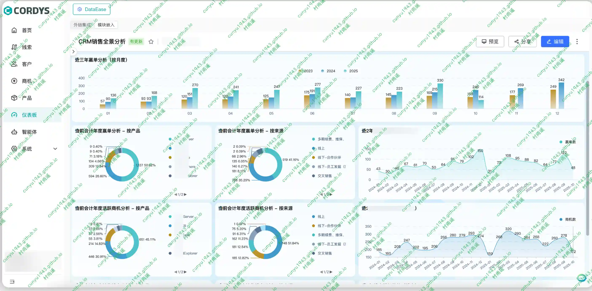
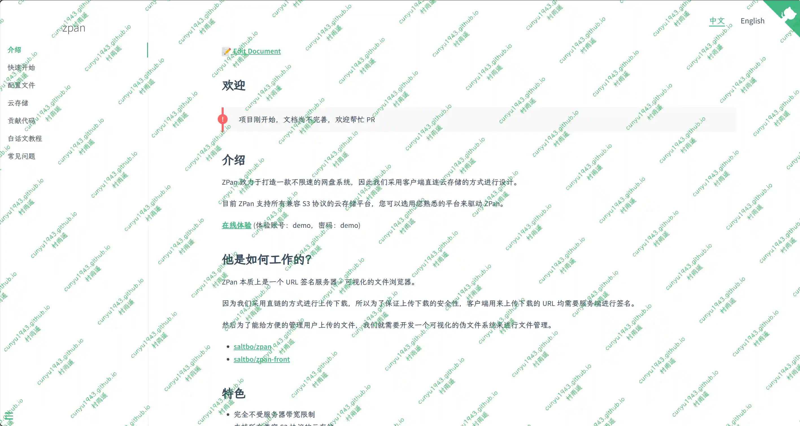
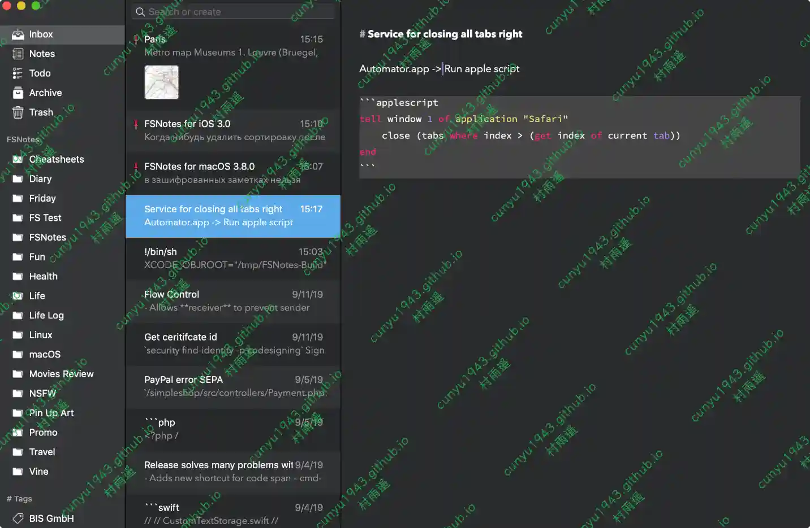
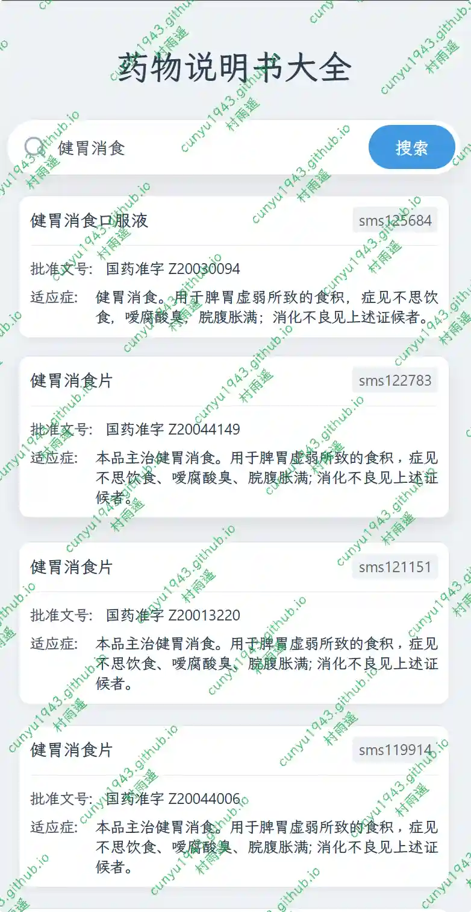
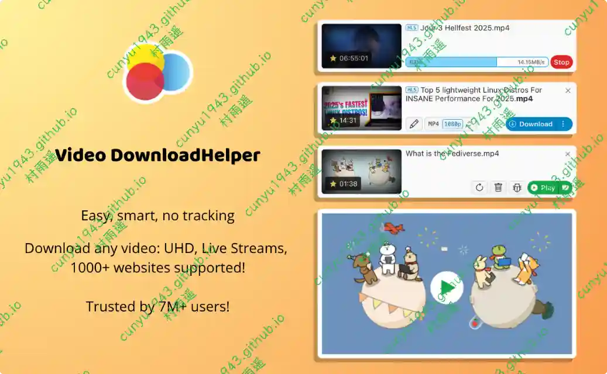
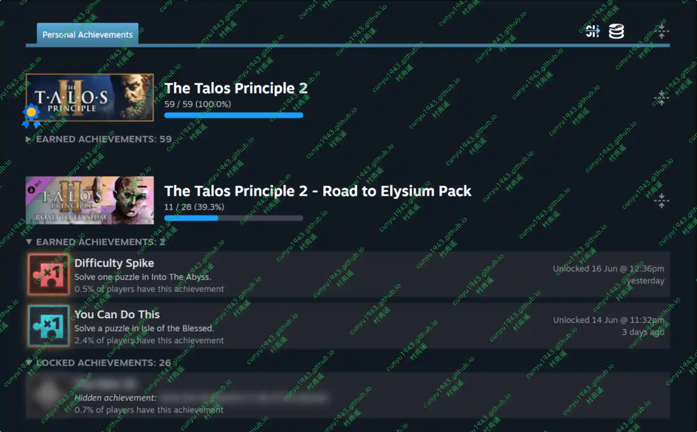
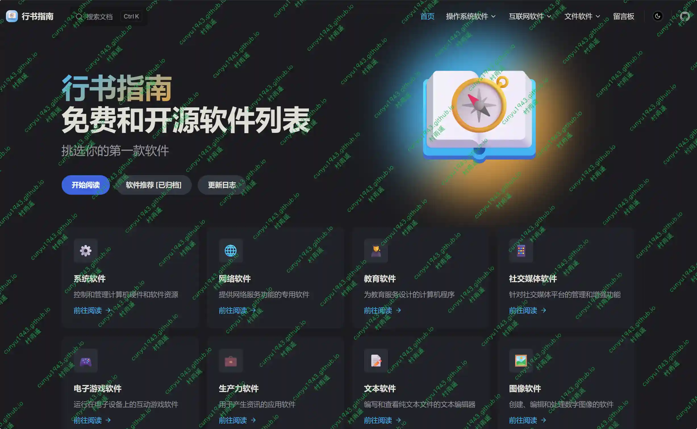

# 好物周刊#135：话袋

> 作者：[村雨遥](https://github.com/cunyu1943)
> 
> 不要哀求，学会争取，若是如此，终有所获
> 
> 原文：https://mp.weixin.qq.com/s/i8DTx9J2dWP0bl3yaF9D5Q

## 🎈 号外 

最近，公众号之外，建立了微信交流群，不定期会在群里分享各种资源（影视、IT 编程、考试提升……）&知识。如果有需要，可以**扫码或者后台添加小编微信备注入群**。进群后**优先看群公告**，**呼叫群中【资源分享小助手】**，还能免费帮找资源哦～

## 一、项目

### 1. [Cordys CRM](https://github.com/1Panel-dev/CordysCRM)

新一代的开源 AI CRM 系统，是集信息化、数字化、智能化于一体的「客户关系管理系统」，由 飞致云 匠心出品。Cordys CRM 能够帮助企业实现从线索到回款（L2C）的全流程精细化管理，覆盖线索获取、智能分配、客户与联系人管理、商机跟进、合同签约及回款执行，构建端到端的销售运营闭环。

### 2. [ZPan](https://github.com/saltbo/zpan)

一个基于云存储的网盘系统，用于自建私人网盘或企业网盘。

### 3. [TaoSync](https://github.com/dr34m-cn/taosync)

一个适用于 OpenList v3 + 的自动化同步工具。

## 二、软件

### 1. [FSNotes](https://github.com/glushchenko/fsnotes)

适用于 macOS 和 iOS 的现代笔记管理器，使用 Swift 5 编写，采用 MIT 许可证开源。

### 2. [话袋](https://ihuadai.cn)

一款集录音转文字、AI 总结、语音识别与笔记管理于一体的智能工具。轻松整理会议纪要、采访内容、学习笔记，让记录更高效、更智能。

### 3. [智谱 AI 输入法](https://autoglm.zhipuai.cn/autotyper)

智谱 AI 输入法是一款智能的 AI 语音输入工具，通过说话就能实现高效创作，告别繁琐打字，说话即成文。

## 三、网站

### 1. [盘大师](https://www.pandashi8.com)

聚合云盘高效搜索，提供阿里云盘、夸克网盘、百度网盘、蓝奏网盘、迅雷网盘、天翼网盘、彩和网盘等网盘资源搜索。更新快、资源全、速度快、免费。

### 2. [夸夸盘搜](https://www.kuakuaso.com)

类似盘大师，聚合各种云盘高效搜索，更新快、资源全、速度快、免费。

### 3. [药物说明书大全](http://drug.ptger.cn)

汇聚数万种药品说明书的在线平台，提供药品名称、成分、适应症、用法用量、不良反应、禁忌症等详细信息，方便用户快速了解药品特性。

## 四、插件

### 1. [Video DownloadHelper](https://chromewebstore.google.com/detail/video-downloadhelper/lmjnegcaeklhafolokijcfjliaokphfk)

最完整的网络视频下载器，主要支持以下功能：

-   将网页中播放的视频保存到本地磁盘
-   支持 HLS 流式视频
-   支持 DASH 视频
-   下载图片库
-   视频文件的智能命名
-   能够将域列入黑名单以隐藏检测到的视频中的广告
-   控制最大并发下载
-   提供可供下载的细粒度过滤视频的多个选项
-   高度可定制的界面
-   将下载或已下载的视频转换为几乎任何格式
-   适用于 Windows、Mac 和 Linux

### 2. [SteamDB](https://chromewebstore.google.com/detail/steamdb/kdbmhfkmnlmbkgbabkdealhhbfhlmmon?hl=zh-CN)

在 Steam 商店和社区页面中添加 SteamDB 链接和新功能，可查阅游戏史低价格和在线统计数据。

### 3. [PDF24 Tools](https://chromewebstore.google.com/detail/pdf24-tools/eoinpcbakedlpilhibkbejdgkifenhfb)

免费易于使用的 PDF 扩展工具，助力提升效率。该扩展将 PDF24 工具带到您的 Chrome 浏览器，使您更有效率，当前大约有 30 个易于使用的 PDF 工具是免费的。

## 五、资料

### 1. [行书指南](https://github.com/xszn/xszn.github.io)

一个自由及开放源代码（FOSS）的软件列表项目，推荐高质量免费与开源软件，降低用户寻找软件的时间成本。

### 2. [从零开始构建智能体](https://github.com/datawhalechina/hello-agents)

从基础理论到实际应用，全面掌握智能体系统的设计与实现。

### 3. [Vibe Coding 开源教程](https://github.com/datawhalechina/vibe-vibe)

首个系统化 Vibe Coding 开源教程，零基础到全栈实战，让人人都能用 AI 开发产品。

## ✍️ 说明

周刊专栏相关信息：

- **项目地址**：[Github](https://github.com/cunyu1943/weekly)，觉得不错麻烦给我一个**Star**，感谢 ❤️
- **浏览地址**：公众号 | [电子书](https://cunyu1943.github.io/weekly) | [语雀](https://yuque.com/cunyu1943/weekly)

如果你阅读到这里，说明我的工作没有白费。如果你想推荐项目/网站/软件/资源，欢迎提交 **[issue](https://github.com/cunyu1943/weekly/issues)** 或者添加我 **个人微信：coder_cunYu** 与我交流。

---

## ⏳ 联系

想解锁更多知识？不妨关注我的微信公众号：**村雨遥（id：JavaPark）**。

扫一扫，探索另一个全新的世界。

