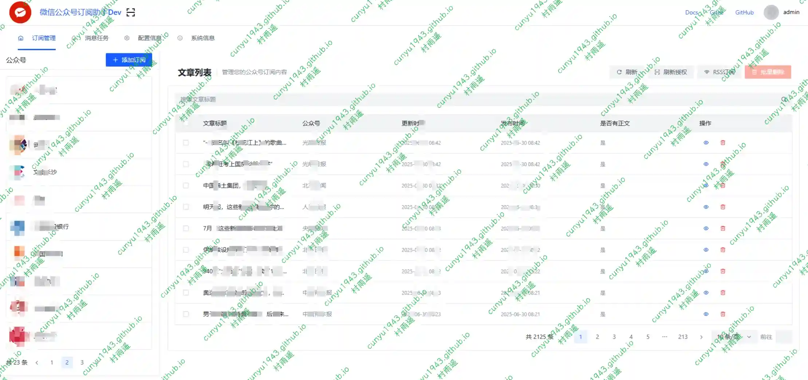
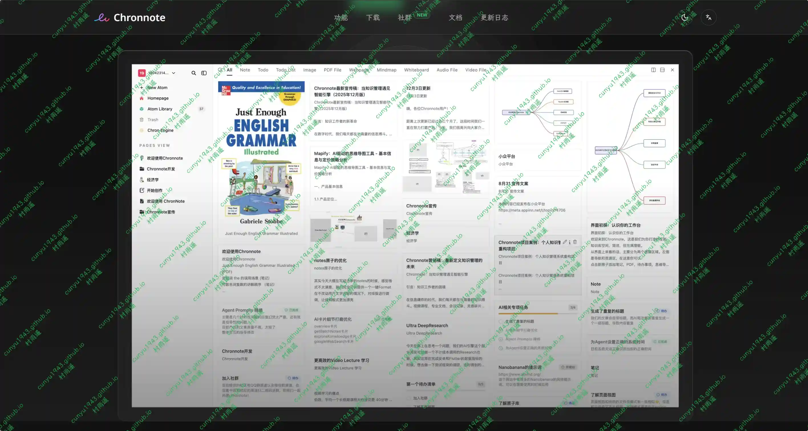
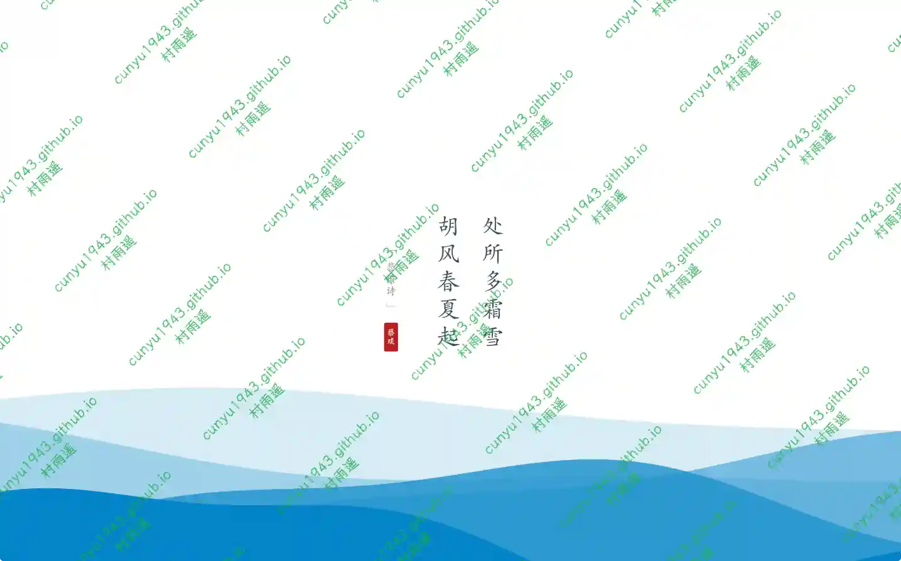

# 好物周刊#136：面试通

> 作者：[村雨遥](https://github.com/cunyu1943)
> 
> 不要哀求，学会争取，若是如此，终有所获
> 
> 原文：https://mp.weixin.qq.com/s/SmXCyor6tSKF690NomdTrQ

## 🎈 号外 

最近，公众号之外，建立了微信交流群，不定期会在群里分享各种资源（影视、IT 编程、考试提升……）&知识。如果有需要，可以**扫码或者后台添加小编微信备注入群**。进群后**优先看群公告**，**呼叫群中【资源分享小助手】**，还能免费帮找资源哦～

## 一、项目 

### 1. [Orion Visor](https://github.com/dromara/orion-visor)

一款高颜值、现代化的自动化运维及轻量堡垒机，提供全面的服务器智能运维解决方案。支持资产管理分组、多协议访问 (SSH、SFTP、RDP、VNC)、实时系统监控与智能告警、文件上传下载、在线编辑、命令批量执行、多主机文件分发和计划任务配置 (通过 cron 表达式) 等功能，确保高效安全的运维体验。适用于 Linux 和 Windows 系统的运维管理。

### 2. [WeRSS](https://github.com/rachelos/we-mp-rss)

符合阅读习惯的微信公众号助手、微信公众号转 MarkDown、微信公众号转 PDF、定时更新订阅公众号文章、生成微信公众号 RSS 订阅源。

### 3. [Con-Nav-Item](https://github.com/zczy-k/Con-Nav-Item)

现代化的个人导航站，提供美观的卡片式导航界面、强大的后台管理系统和功能丰富的浏览器扩展。

## 二、软件

### 1. [Chronnote](https://chronnote.top)

All in one 的笔记知识库。基于原子化理念的知识操作系统。它打破了笔记、导图与文档的格式壁垒，将所有信息单元视为同权的‘知识原子’。在 Chron 引擎的驱动下，您可以在统一的工作区内，体验知识形态自由转换与无限编排的流畅心流。

### 2. [万枝](https://github.com/badwolfbay/Wanzhi)

一款 Windows 系统更换壁纸软件，内含动态壁纸 + 每日诗词组合。

### 3. [WitNote](https://github.com/hooosberg/WitNote)

一款本地优先的 AI 写作伴侣，支持 macOS 和 Windows 平台。 内置 Ollama AI 引擎，搭配极简原生卡片界面，开箱即用。无云端依赖，无隐私焦虑，让智能回归轻盈。

## 三、网站

### 1. [甲方导航](https://jiafangbb.com)

简洁的工作娱乐网址导航网站，办公摸鱼两不误。

### 2. [面试通](https://bimiantong.com)

您的AI面试助手，实时精准识别面试官问题，生成专业回答，助您从容应对每场面试，轻松获得理想工作

### 3. [Isocons](https://www.isocons.app)

3D 等角图标库，提供了高质量的图标素材，设计师必备。

## 四、插件

### 1. [Control Panel for Twitter](https://chromewebstore.google.com/detail/control-panel-for-twitter/kpmjjdhbcfebfjgdnpjagcndoelnidfj?hl=zh-CN)

让你对 Twitter 有更多的控制，并增加了缺失的功能和 UI 改进。

### 2. [多重 URL 打开器](https://chromewebstore.google.com/detail/multiple-url-opener/jfanmjbbnmijbkhgnkpbaclkfeliinob)

快速打开 URL，批量 URL  打开器彻底改变你的浏览方式，最大限度地提高你的在线效率。

### 3. [电报视频下载器](https://chromewebstore.google.com/detail/telegram-video-downloader/kljkjamilbfohkmbacbdongkddmoliag)

一键下载电报私人频道和群组中的视频、音频和图片。安全易用，帮助用户将 Telegram 受限频道中的媒体内容存储到本地，轻松下载所有内容。

## 五、资料

### 1. [FreeBSD 从入门到跑路](https://github.com/FreeBSD-Ask/FreeBSD-Ask)

一本开源的 FreeBSD 操作系统研究书籍，还包含一些关于 OpenBSD、NetBSD 等 Berkeley Unix 家族系统的导论章节。

### 2. [大厂项目复盘](https://www.yuque.com/wikidesign/ykf0s9)

收集各大厂项目复盘文章，帮助你学习大厂项目经验。

### 3. [Python 1024](https://www.yuque.com/yichu/python)

Python 教程，分为基础篇、自动化办公篇、数据处理篇，从理论到实践，帮助你更好地掌握 Python。

## ✍️ 说明

周刊专栏相关信息：

- **项目地址**：[Github](https://github.com/cunyu1943/weekly)，觉得不错麻烦给我一个**Star**，感谢 ❤️
- **浏览地址**：公众号 | [电子书](https://cunyu1943.github.io/weekly) | [语雀](https://yuque.com/cunyu1943/weekly)

如果你阅读到这里，说明我的工作没有白费。如果你想推荐项目/网站/软件/资源，欢迎提交 **[issue](https://github.com/cunyu1943/weekly/issues)** 或者添加我 **个人微信：coder_cunYu** 与我交流。

---

## ⏳ 联系

想解锁更多知识？不妨关注我的微信公众号：**村雨遥（id：JavaPark）**。

扫一扫，探索另一个全新的世界。

