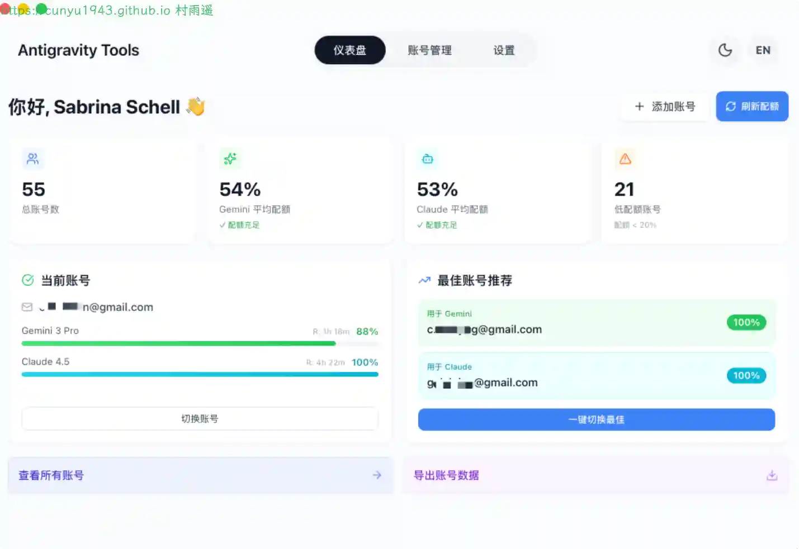
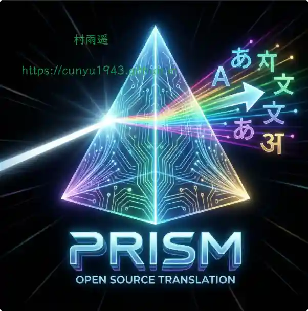
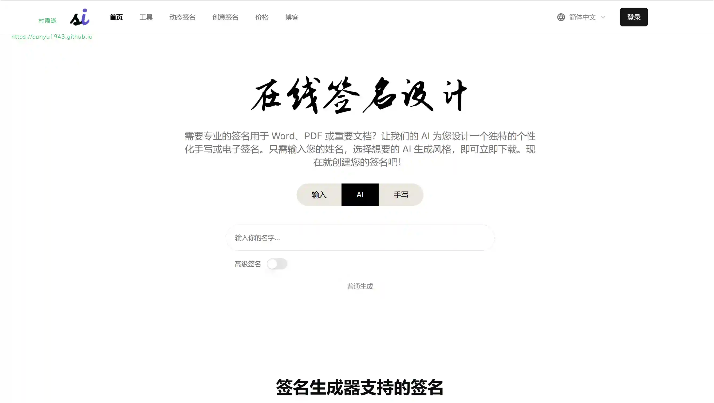
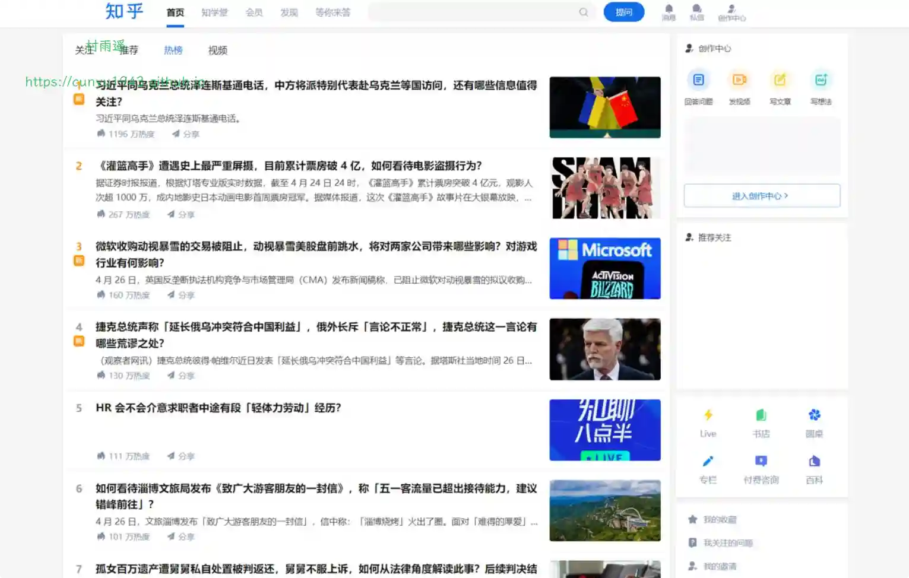
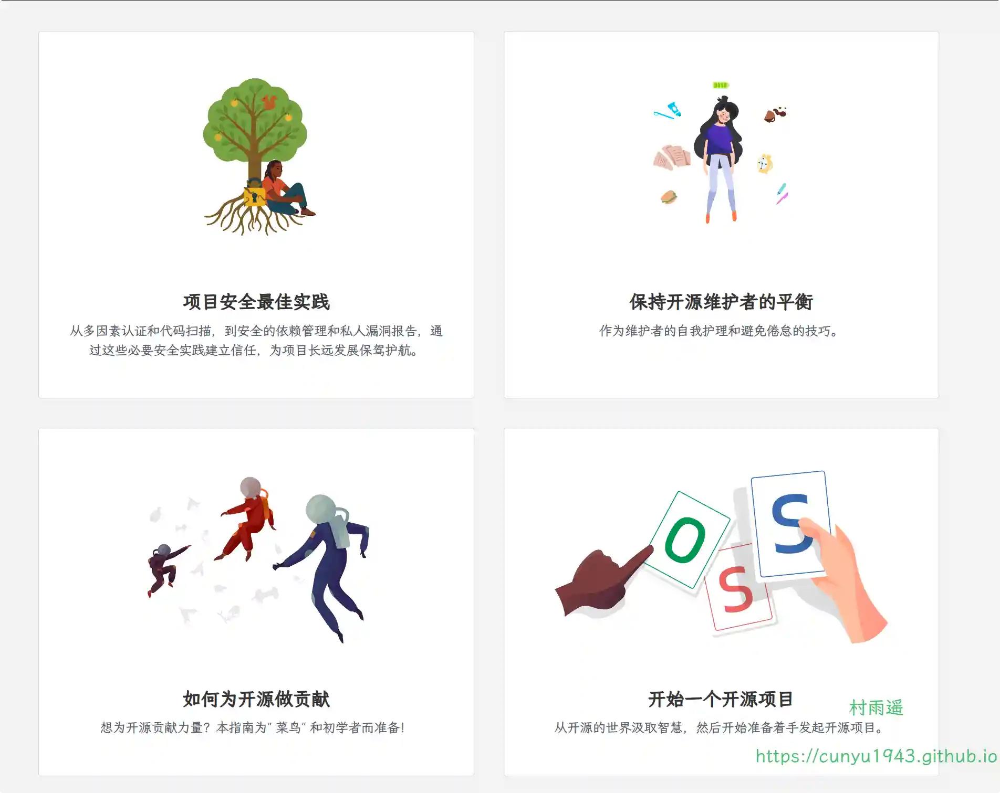

# 好物周刊#137：数智法度

> 作者：[村雨遥](https://github.com/cunyu1943)
> 
> 不要哀求，学会争取，若是如此，终有所获
> 
> 原文：https://mp.weixin.qq.com/s/sxPyQmjFgmIFHAdKCWUm3A

## 🎈 号外 

最近，公众号之外，建立了微信交流群，不定期会在群里分享各种资源（影视、IT 编程、考试提升……）&知识。如果有需要，可以**扫码或者后台添加小编微信备注入群**。进群后**优先看群公告**，**呼叫群中【资源分享小助手】**，还能免费帮找资源哦～

## 一、项目

### 1. [Antigravity Tools](https://github.com/lbjlaq/Antigravity-Manager)

一个专为开发者和 AI 爱好者设计的全功能桌面应用。它将多账号管理、协议转换和智能请求调度完美结合，为您提供一个稳定、极速且成本低廉的 本地 AI 中转站。通过本应用，您可以将常见的 Web 端 Session (Google / Anthropic) 转化为标准化的 API 接口，彻底消除不同厂商间的协议鸿沟。

### 2. [MrRSS](https://github.com/WCY-dt/MrRSS)

一个现代化、跨平台且免费的 AI RSS 阅读器。

### 3. [Kube-Nova](https://github.com/yanshicheng/kube-nova)

一个企业级 Kubernetes 多集群管理平台，以项目为视角实现多租户、多集群的资源隔离与统一管理。平台采用项目 → 集群配额 → 工作空间三级架构，提供完整的 RBAC 权限体系、资源超分、告警中心、灰度发布等企业级特性。

## 二、软件

### 1. [Prism](https://github.com/qyzhg/prism)

一款强大的跨平台 AI 翻译应用，采用先进的语言模型和 OCR 技术。

### 2. [试试双拼](https://ulpb.app)

免费在线双拼练习工具，支持自然码、搜狗双拼、小鹤双拼、微软双拼等 7 种主流方案。提供实时反馈、虚拟键盘、进阶模式等功能，帮助你快速掌握双拼输入法，显著提高打字速度和输入效率。零基础入门，专业练习平台。

### 3. [秒言](https://miaoyan.cn)

毫秒级极速响应，精准识别。智能重组碎片化语言，还原你的输入原意。懂你的 AI 语音输入法。

## 三、网站

### 1. [在线签名设计](https://signaturegen.ai/zh)

AI 为您设计一个独特的个性化手写或电子签名，免费。只需输入您的姓名，选择完美的 AI 生成风格，即可立即下载，设计属于您独一无二的签名。

### 2. [猫头鹰智能网页订阅](https://www.mtywatch.com)

一款智能 AI 驱动的网站订阅工具，支持网页变化订阅、价格订阅、商品订阅、竞品分析。自动检测网页数据变化，实时邮件、短信、钉钉、飞书多渠道通知。简单配置，智能爬取，让您轻松掌握网络动态。

### 3. [数智法度](https://laws.szsyw.cn)

法律法规数据检索平台，汇集了大量国家和地方的法律法规、司法解释、行政法规等内容。

## 四、插件

### 1. [宽乎](https://microsoftedge.microsoft.com/addons/detail/宽乎/hmindbfdihniclppncnibofigclijheb)

为用户提供修改知乎内容显示区域宽度的功能和修改内容图片大小的功能，使得用户能够根据自己的喜好自定义调节内容显示区域大小，调整知乎网页端让其能够显示更多的内容，优化用户浏览体验。

### 2. [115 闪推](https://chromewebstore.google.com/detail/adppjpplkdfnnincbegikjnalffkkcko?utm_source=item-share-cb)

智能收集网页中的所有的资源链接 (磁力链接、ED2k、种子)。一键批量推送到 115 网盘离线云任务。

### 3. [B2Y](https://chromewebstore.google.com/detail/dmkbhbnbpfijhgpnfahfioedledohfja?utm_source=item-share-cb)

自动将 Bilibili 的弹幕同步显示在 YouTube 视频上，让 YouTube 视频也能拥有 B 站的弹幕氛围！

## 五、资料 

### 1. [代码安全指南](https://github.com/Tencent/secguide)

面向开发人员梳理的代码安全指南，旨在梳理 API 层面的风险点并提供详实可行的安全编码方案。

### 2. [Open Source Guides](https://github.com/github/opensource.guide)

为希望学习如何运行和贡献开源项目的个人、社区和公司提供的资源集合。由 GitHub 创建和策划，目标是汇总社区最佳实践。

### 3. [CppCoreGuidelines](https://github.com/isocpp/CppCoreGuidelines)

一套关于 C++ 编码的行之有效的准则、规则和最佳实践。

## ✍️ 说明

周刊专栏相关信息：

- **项目地址**：[Github](https://github.com/cunyu1943/weekly)，觉得不错麻烦给我一个**Star**，感谢 ❤️
- **浏览地址**：公众号 | [电子书](https://cunyu1943.github.io/weekly) | [语雀](https://yuque.com/cunyu1943/weekly)

如果你阅读到这里，说明我的工作没有白费。如果你想推荐项目/网站/软件/资源，欢迎提交 **[issue](https://github.com/cunyu1943/weekly/issues)** 或者添加我 **个人微信：coder_cunYu** 与我交流。

---

## ⏳ 联系

想解锁更多知识？不妨关注我的微信公众号：**村雨遥（id：JavaPark）**。

扫一扫，探索另一个全新的世界。

