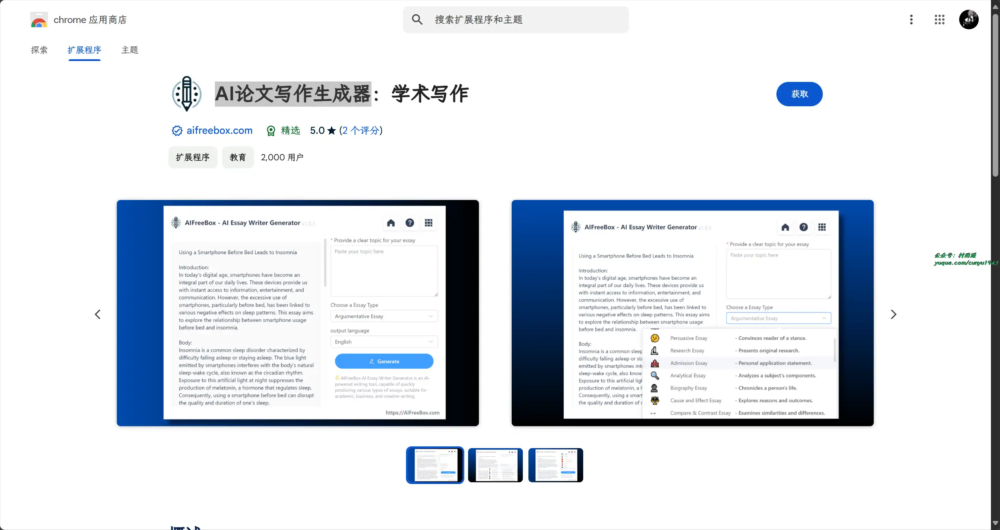
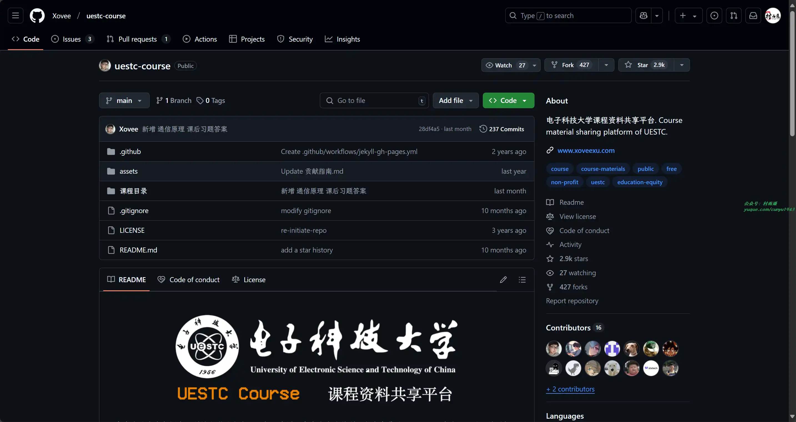

# 好物周刊#89：习惯点点

> 作者：[村雨遥](https://github.com/cunyu1943)
> 
> 不要哀求，学会争取，若是如此，终有所获
> 
> 原文：https://mp.weixin.qq.com/s/mKV3fNQxiVR7IykYg0mg-Q

## 🎈 号外

最近，公众号之外，建立了微信交流群，不定期会在群里分享各种资源（影视、IT 编程、考试提升……）&知识。如果有需要，可以**扫码或者后台添加小编微信备注入群**。进群后**优先看群公告**，**呼叫群中【资源分享小助手】**，还能免费帮找资源哦～

 

## 一、项目

### 1. [cat](https://github.com/dianping/cat)

作为服务端项目基础组件，提供了 Java, C/C++, Node.js, Python, Go 等多语言客户端，已经在美团点评的基础架构中间件框架（MVC 框架，RPC 框架，数据库框架，缓存框架等，消息队列，配置系统等）深度集成，为美团点评各业务线提供系统丰富的性能指标、健康状况、实时告警等。

### 2. [惺惺](https://github.com/cherish-chat/xxim-server)

属于你的社交地盘！惺惺是一个 100% 开源社交平台，每个人都可以搭建自己的服务器，掌握数据的所有权。

### 3. [goodsKill](https://github.com/techa03/goodsKill)

基于 SpringCloud 2023.x + Dubbo 3.x + AI 构建的模拟秒杀微服务项目，集成了 Elasticsearch、Gateway、Mybatis-Plus、Sharding-JDBC 等常用开源组件。

## 二、软件

### 1. [vivo 听说](https://accessibility.vivo.com/accessibility/hear)

一款集实时语音转文字、文字播报等功能的专业 App，可满足用户在不方便说话或倾听情况下， 实现无障碍沟通；文字放大查看更便捷，让沟通更简单。

### 2. [习惯点点](https://habitdots.com)

帮你培养每日学习、工作、锻炼、读书、早睡、喝水、运动、减肥打卡等微习惯。

### 3. [Zotero](https://www.zotero.org/)

开源文献管理工具，支持插件，集成浏览器插件一起使用更方便。

## 三、网站

### 1. [帽子云](https://www.maoziyun.com)

国产 GitHub Pages / Cloudflare Pages 替代方案，旨在解决国内用户部署网站时面临的种种困难。技术上，帽子云采用领先的云原生架构，结合 CDN 加速与持续集成功能，提供高效、便捷的静态网站部署体验。同时，通过自建 CDN 节点，针对中国大陆优化精品线路，支持智能化节点选择，大幅降低网络延迟，让页面加载更快，为用户提供流畅的访问体验。

### 2. [Cloudflare](https://www.cloudflare.com/zh-cn/)

一个全球性的云平台，它为世界各地的各种规模的企业提供广泛的网络服务，从而使企业更加安全，同时提高其关键互联网资产的性能和可靠性。

### 3. [又拍云](https://console.upyun.com/register/?invite=9LfDr1C_y)

国内知名企业级云服务商，全球 1100 多个自建 CDN 节点，10TB 保有带宽，为 25 万用户提供 CDN 加速，数据云存储，HTTPS／SSL 证书，WebP，云处理，视频图片存储，短视频开发SDK，直播开发SDK，DDos 高防等一站式加速解决方案！

## 四、插件

### 1. [Google 学术搜索 PDF 阅读器](https://chromewebstore.google.com/detail/google-学术搜索-pdf-阅读器/dahenjhkoodjbpjheillcadbppiidmhp?hl=zh-CN)

提升论文阅读体验：追踪参考文献、重点浏览大纲、跳转到图表、引用并保存。安装学术搜索阅读器后，就能在 Chrome 中以全新方式查看所有网站上的 PDF 文件。

### 2. [文献泡泡](https://chromewebstore.google.com/detail/文献泡泡-pubmed、google学术、知网等多/pdmgonafkgopgipcmgfpfobgknbofnpn)

安装后即可显示期刊影响因子、分区等级，还支持一键排序和导出 Excel。

### 3. [AI 论文写作生成器](https://chromewebstore.google.com/detail/ai论文写作生成器：学术写作/lnpeflilbcimmlbenlpphfbpmocmjpgk)

 免费最佳 AI 论文写作生成器：适合学生和专业人士，提高论文和报告的创作。

## 五、资料

### 1. [Go 程序员宝典](https://github.com/shgopher/GOFamily)

项目中包含了 Go 基础语法，Go 并发模式，Go runtime 实现原理 ，企业级 Go 语言项目经验等方面内容。

### 2. [学习周刊](https://github.com/eryajf/learning-weekly)

周刊内容以运维技术和 Golang 为主，以及 GitHub 上优秀项目或经验。

### 3. [电子科技大学课程资料共享平台](https://github.com/Xovee/uestc-course)

仓库内容包括电子科技大学的各类课程复习资料，为非营利、永久免费的开源项目，仓库目的在于推动知识传播、提高资源质量、减少获取成本、提倡无纸化资料、促进教育公平，让电科学子在备考、复习之时不必再苦寻资料。目前已收录 110 余门课程，1300 多个资源。

## ✍️ 说明

周刊专栏相关信息：

- **项目地址**：[Github](https://github.com/cunyu1943/weekly)，觉得不错麻烦给我一个**Star**，感谢 ❤️
- **浏览地址**：公众号 | [电子书](https://cunyu1943.github.io/weekly) | [语雀](https://yuque.com/cunyu1943/weekly)

如果你阅读到这里，说明我的工作没有白费。如果你想推荐项目/网站/软件/资源，欢迎提交 **[issue](https://github.com/cunyu1943/weekly/issues)** 或者添加我 **个人微信：coder_cunYu** 与我交流。

---

## ⏳ 联系

想解锁更多知识？不妨关注我的微信公众号：**村雨遥（id：JavaPark）**。

扫一扫，探索另一个全新的世界。

